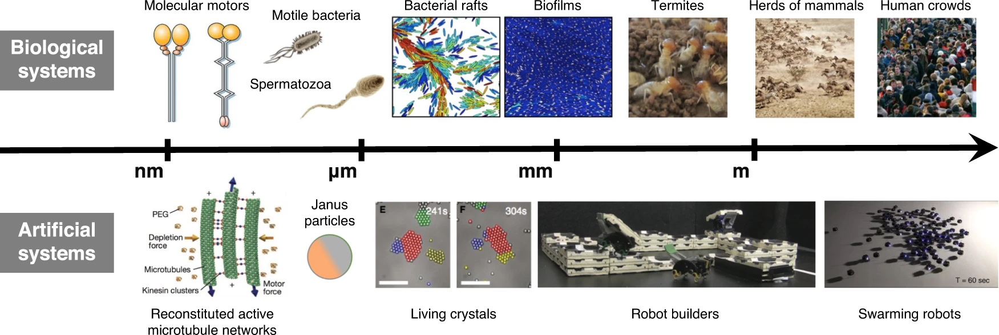
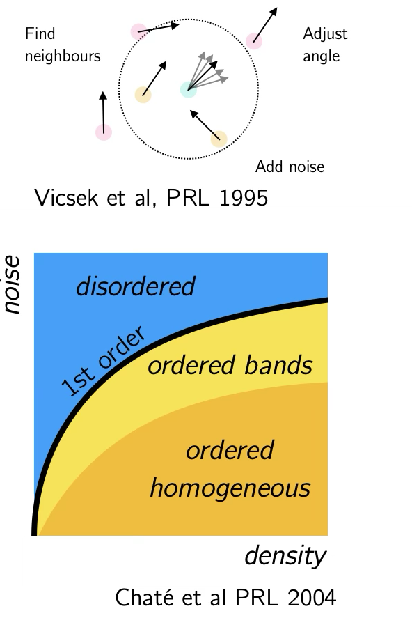
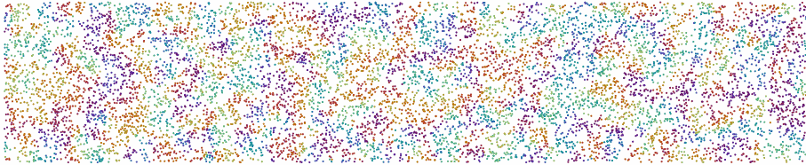
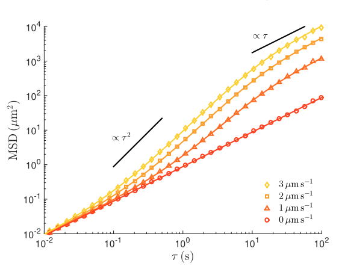
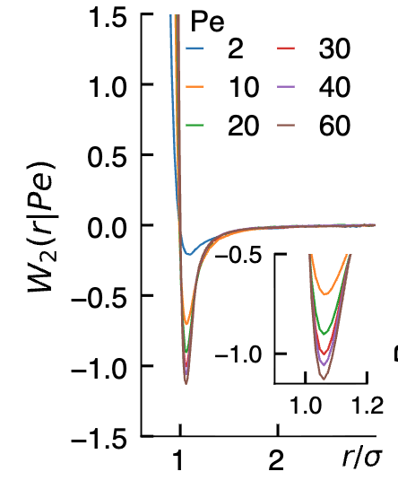
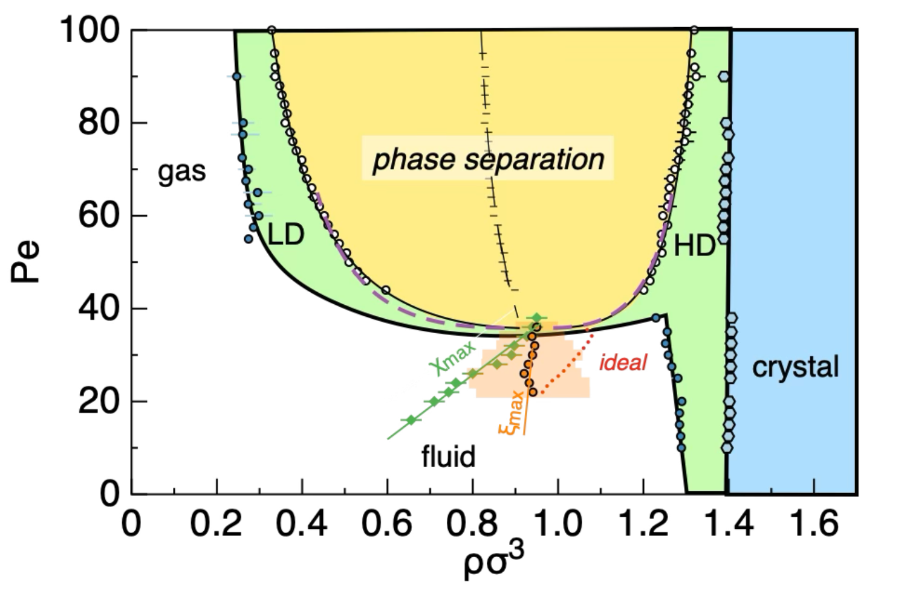
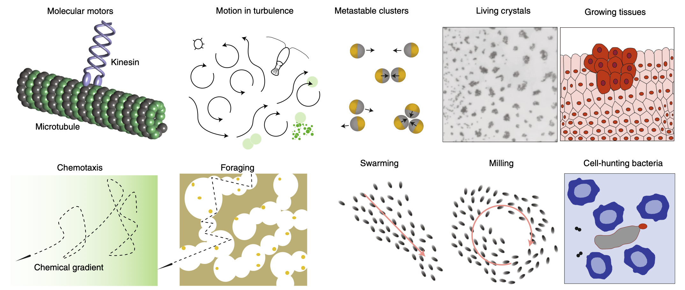

## Today

- Beyond thermal equilibrium
- Run-and-tumble dynamics
- Active Brownian particles
- Motility-induced phase separation (MIPS)

## Beyond Thermal Systems

:::{.columns}
::: {.column width="50%"}
**Equilibrium systems systems**:

- Free energy is optimised (subject to constraints):
- Distribution of states given by Boltzmann statistics:
  $$P(\text{state}) \propto e^{-E(\text{state})/k_BT}$$

**Arrested systems**

- Supercooled liquids: local equilibrium (thermal)
- Glasses/gels: slow relaxation (towards equilibrium)

:::
::: {.column width="50%"}
**Active matter**: Nonequilibrium via **local dissipation**

- Local energy consumption
- Self-propulsion
- Dissipation at microscopic scale


**Examples:**

- Bacteria
- Synthetic microswimmers
- Molecular motors
- Bird flocks, fish schools
:::
:::

:::{.callout-important appearance="minimal"}
In a active systems, the distribution of states is **not given** by Boltzmann statistics!
:::

## Examples of Active Matter
Some examples


## Flocking as a minimal model



## Flocking as a minimal model

The **Vicsek model** (1995) was one of the simplest models of active matter. Key ingredients: **alignment  + self propulsion**


:::: {.columns}
::: {.column width="50%"}
- $N$ particles with positions $\mathbf{r}_i$ and orientations $\theta_i$
- Update rules:
    $$\mathbf{r}_i(t+1) = \mathbf{r}_i(t) + v_0 \hat{\mathbf{n}}_i(t)$$
    $$\theta_i(t+1) = \langle \theta_j \rangle_{|\mathbf{r}_j - \mathbf{r}_i| < R} + \eta_i$$

- $v_0$: constant speed
- $R$: interaction radius
- $\eta_i$: noise term (uniform random in $[-\pi/2, \pi/2]$)
:::

::: {.column width="50%"}


{height=600}
:::
::::

## Flocking as a minimal model


## Run-and-Tumble Motion

Further inspirations from the microbial world, where dissipation can be more directly observed (and even tuned).

**Inspired by bacterial motion** (*E. coli*)

:::: {.columns}
::: {.column width="50%"}
**Two phases:**

- **Run**: Straight-line motion at constant speed $v_0$
- **Tumble**: Random reorientation

**Key parameter**: Tumble rate $\lambda$
:::

::: {.column width="50%"}

:::
::::

## Run-and-Tumble: Dynamics

```{ojs}
//| code-fold: true
//| fig-cap: "Non-interacting run and tumble particles."
viewof simulation = {
    const n = 300, W = 1000, H = 500, dt = 0.5, v0 = 1.5;

    const tumbleSlider = Inputs.range([0.01, 1.0
    ], {step:0.01, value:0.1, label:"Tumble rate λ"});
    const button = html`<button>Pause</button>`;
    let running = true;
    button.onclick = () => {
        running = !running;
        button.textContent = running ? "Pause" : "Resume";
    };

    let state = Array.from({length: n}, () => ({
        x: Math.random() * W,
        y: Math.random() * H,
        theta: Math.random() * 2 * Math.PI
    }));

    // Each particle gets a trace array
    let traces = Array.from({length: n}, () => []);

    // Reset traces when tumble rate changes
    let lastLambda = tumbleSlider.value;
    tumbleSlider.addEventListener("input", () => {
        traces = Array.from({length: n}, () => []);
        lastLambda = tumbleSlider.value;
    });

    function step(state, λ) {
        return state.map((p, i) => {
            if (Math.random() < λ * dt) p.theta = Math.random() * 2 * Math.PI;

            // Predict next position
            let nx = p.x + v0 * Math.cos(p.theta) * dt;
            let ny = p.y + v0 * Math.sin(p.theta) * dt;

            // Bounce at left/right walls
            if (nx < 0) {
                p.x = 0;
                p.theta = Math.PI - Math.random() * Math.PI; // random angle pointing right
            } else if (nx > W) {
                p.x = W;
                p.theta = Math.PI + Math.random() * Math.PI; // random angle pointing left
            } else {
                p.x = nx;
            }

            // Bounce at top/bottom walls
            if (ny < 0) {
                p.y = 0;
                p.theta = (Math.random() * Math.PI); // random angle pointing down
            } else if (ny > H) {
                p.y = H;
                p.theta = Math.PI + (Math.random() * Math.PI); // random angle pointing up
            } else {
                p.y = ny;
            }

            // Add current position to trace
            traces[i].push([p.x, p.y]);
            // Limit trace length for performance
            if (traces[i].length > 200) traces[i].shift();
            return p;
        });
    }

    const container = html`<div></div>`;
    container.append(tumbleSlider, button);
    const svg = d3.select(container).append("svg")
        .attr("width", W)
        .attr("height", H)
        .style("background", "#f8f8f8");

    while (true) {
        const λ = tumbleSlider.value;
        if (running) state = step(state, λ);

        svg.selectAll("*").remove();

        // Draw traces
        traces.forEach(trace => {
            if (trace.length > 1) {
                svg.append("path")
                    .attr("d", d3.line()(trace))
                    .attr("stroke", "#90caf9")
                    .attr("stroke-width", 1)
                    .attr("fill", "none");
            }
        });

        // Draw particles
        svg.selectAll("circle")
            .data(state)
            .enter().append("circle")
            .attr("cx", d => d.x)
            .attr("cy", d => d.y)
            .attr("r", 3)
            .attr("fill", "#1976d2");

        svg.selectAll("line")
            .data(state)
            .enter().append("line")
            .attr("x1", d => d.x)
            .attr("y1", d => d.y)
            .attr("x2", d => d.x + 10 * Math.cos(d.theta))
            .attr("y2", d => d.y + 10 * Math.sin(d.theta))
            .attr("stroke", "#1976d2")
            .attr("stroke-width", 1.2);

        yield container;
        await Promises.delay(16);
    }
}

```

## Run-and-Tumble dynamics

**Run phase** (constant velocity):
$$\mathbf{r}(t + \Delta t) = \mathbf{r}(t) + v_0 \hat{\mathbf{n}}(t) \Delta t$$

**Tumble phase** (random reorientation):

- With probability $\lambda \Delta t$: randomize $\hat{\mathbf{n}}$
- Otherwise: continue running

## Mean Squared Displacement


Two regimes

1. **Ballistic** (short times): $\langle \Delta r^2(t) \rangle \sim v_0^2 t^2$

2. **Diffusive** (long times, $t \gg 1/\lambda$): $\langle \Delta r^2(t) \rangle \sim 2 D_{\text{eff}} t$
   - Effective diffusion: $D_{\text{eff}} = \frac{v_0^2}{2\lambda}$ (2D)

Crossover time: $t_c \sim 1/\lambda$

```{python}
#| autorun: true
import numpy as np
import matplotlib.pyplot as plt

# Parameters
N = 300           # number of particles
v0 = 1.0            # speed
lambda_tumble = 0.1 # tumble rate
dt = 0.01           # time step
T = 1000             # total time
steps = int(T/dt)

# Arrays to store positions
x = np.zeros((N, steps))
y = np.zeros((N, steps))
theta = np.random.uniform(0, 2*np.pi, N)

# Simulate run-and-tumble
for t in range(1, steps):
    tumble = np.random.rand(N) < lambda_tumble * dt
    theta[tumble] = np.random.uniform(0, 2*np.pi, tumble.sum())
    x[:, t] = x[:, t-1] + v0 * np.cos(theta) * dt
    y[:, t] = y[:, t-1] + v0 * np.sin(theta) * dt 

# Compute MSD
msd = np.mean((x - x[:, 0:1])**2 + (y - y[:, 0:1])**2, axis=0)
time = np.arange(steps) * dt

#Plotting
plt.figure(figsize=(9,4))
t_ballistic = 1 / (10 * lambda_tumble)
t_crossover = 1 / lambda_tumble
t_diffusive = 10 / lambda_tumble
# Plot
plt.loglog(time, msd, label="Simulated MSD")
plt.loglog(time, (v0*time)**2, '--', label=r"Ballistic: $v_0^2 t^2$")
plt.loglog(time, 2*(v0**2/(2*lambda_tumble))*time, '--', label=r"Diffusive: $2D_\mathrm{eff} t$")
plt.xlim(1*dt,time.max())
plt.tick_params(axis='both', labelsize=8, pad=15)
plt.tight_layout()


plt.xlabel("Time $t$")
plt.ylabel(r"MSD $\langle \Delta r^2(t) \rangle$")
plt.legend(frameon=False)

plt.show()
```

## Active Brownian Particles (ABPs)

**Minimal model for self-propelled colloids** (e.g., Janus particles)

:::: {.columns}
::: {.column width="50%"}
**Dynamics:**

- Translational motion
$$\frac{d\mathbf{r}}{dt} = v_0 \hat{\mathbf{n}}(t) + \sqrt{2D_t} \boldsymbol{\xi}(t)$$

- Rotational motion
$$\frac{d\theta}{dt} = \sqrt{2D_r} \eta(t)$$
:::

::: {.column width="50%"}
- $v_0$: self-propulsion speed
- $D_t$: translational diffusion
- $D_r$: rotational diffusion
- Continuous reorientation

**Péclet Number:**
$$Pe = \frac{v_0}{\sqrt{D_t D_r}} = \frac{v_0}{D_r L}$$

- Measures activity strength vs thermal motion
- $Pe \ll 1$: thermal equilibrium limit
- $Pe \gg 1$: strong activity, far from equilibrium
- $L = \sqrt{D_t/D_r}$: characteristic length scale
:::
::::

## ABP: Mean Squared Displacement

**Three regimes:**

$$\langle \Delta r^2(\tau) \rangle = \left[4 D_T + 2 v^2 \tau_R \right] \tau + 2 v^2 \tau_R^2 \left( e^{-\tau / \tau_R} - 1 \right)$$

:::: {.columns}
::: {.column width="30%"}
1. **Short times**: Diffusive $\sim 4D_T\tau$
2. **Intermediate**: Ballistic $\sim v_0^2\tau^2$
3. **Long times**: Enhanced diffusion

- $\tau_R = 1/D_r$: persistence time
- $D_{\mathrm{eff}} = \frac{v_0^2}{2D_r}$: effective diffusion
:::

::: {.column width="70%"}

{height=500}

:::
::::


## Effective Interactions

:::: {.columns}
::: {.column width="50%"}
The persistence of active motion can lead to effective interactions between particles.

- Head-to-head collisions lead to a persistence time of contact between two particles

- This can be seen as an effective attraction between particles



:::

::: {.column width="50%"}

:::
::::

(The realiity is more complex, with many-body effects!)


## Motility-Induced Phase Separation (MIPS)

**Interacting ABPs** → nonequilibrium self-organization

{width=70%}

**Key idea**: Purely repulsive particles (hard spheres) + ABP dynamics

## MIPS Mechanism

:::: {.columns}
::: {.column width="50%"}
**Equilibrium** (no self-propulsion):

- Hard spheres
- No liquid-gas separation

**Active** (with self-propulsion):

- Head-to-head collisions
- Finite residence time
- Many-body caging
- Density heterogeneities
:::

::: {.column width="50%"}
**As $D_r$ decreases:**

- More persistent motion
- System more out-of-equilibrium
- Enhanced density fluctuations
- **Spontaneous phase separation**
:::
::::

## MIPS: Critical-like Behavior

**Phase diagram features:**

- **Low $D_r$**: Dense + dilute phases (like liquid-gas)
- **Critical point**: Enhanced fluctuations
- MIPS exists both in 2d and 3D:
    - in 2D, disk ordering at high densities
    - in 3D, MIPS is **metastable** to gas-crystal, like colloid polymer mixtures.
- **Short-range effective interactions** between active particles

**Result**: Nonequilibrium phase transition in purely repulsive system!


## Experimental realisation of active matter 

In experiments, active systems can be realised in various ways:

:::{.columns}
::: {.column width="50%"}
- **Bacterial suspensions**: e.g., *E. coli*, *B. subtilis*
- **Synthetic microswimmers**: Janus particles with catalytic coatings
- **Light-activated colloids**: Particles that change motility under light
:::
::: {.column width="50%"}
- **Vibrated granular matter**: Macroscopic particles on vibrating plates
- **Nano- and micro-robots**: Swarms of tiny robots with programmed motion
:::
:::

