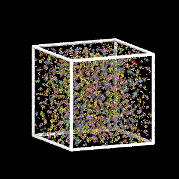
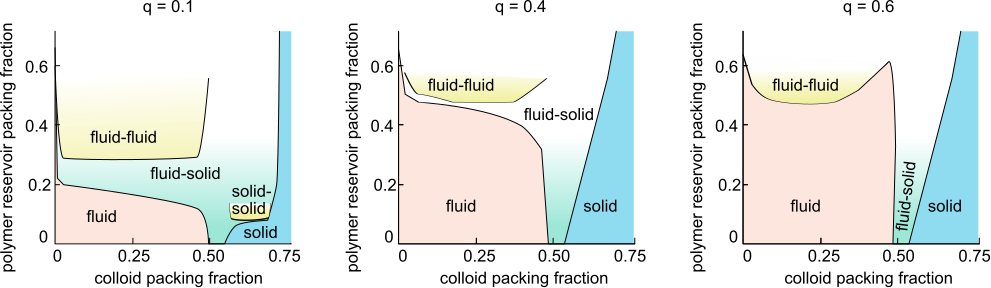
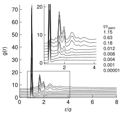
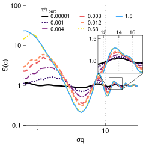
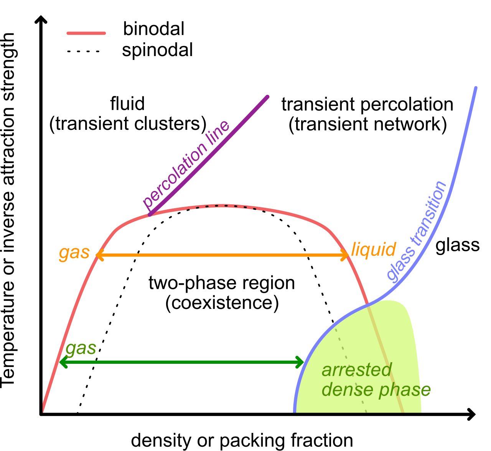

## Today

- Physical gels and percolation
- Colloid-polymer mixtures
- Structure and characterization
- Arrested spinodal decomposition

## What is a Physical Gel?

**Physical gel**: Particles/polymers connected via **reversible**, non-covalent bonds forming a **percolating network**

:::: {.columns}
::: {.column width="50%"}
**Key features:**

- Bonds break/reform dynamically
- Energy ~ $k_BT$
- Self-healing possible
- **Thermoreversible**
:::

::: {.column width="50%"}
**Examples:**

- Gelatin
- Agarose
- Yoghurt
- Paint, inks
:::
::::

Cross-links form via dense local regions (microcrystalline/glassy)

## Physical vs Chemical Gels

:::: {.columns}
::: {.column width="50%"}
**Physical Gels**

- Reversible bonds
- Energy ~ $k_BT$
- Dynamic network
- Thermoreversible
:::

::: {.column width="50%"}
**Chemical Gels**

- Irreversible covalent bonds
- High energy barriers
- Permanent network
:::
::::

**Key transition**: 

- Fluid → Gel occurs when a **system-spanning cluster** forms (**percolation**)
- Dramatic viscosity increase + elastic response

Gels are a second example of disordered solids (after glasses)

## Percolation Theory

**Problem**: Square grid $L\times L$ sites, randomly label $N$ of them. When does a spanning cluster form?

:::: {.columns}
::: {.column width="50%"}

- $p = N/L^2$ = occupation probability
- **Percolation threshold** $p_c$
- Below $p_c$: small clusters
- Above $p_c$: giant spanning cluster
:::

::: {.column width="50%"}
**2D square lattice:**
$$p_c \approx 0.5927$$

**Transition**: Continuous (2nd order)
:::
::::

## Percolation Simulation

```{pyodide}
#| echo: false
#| autorun: true
import numpy as np
import matplotlib.pyplot as plt
from scipy.ndimage import label

def sample_percolation(
    L = 50,  # grid size
    p = 0.2  # occupation probability
):
    # Generate random grid
    grid = np.random.rand(L, L) < p

    # Label clusters
    structure = np.array([[0,1,0],[1,1,1],[0,1,0]], dtype=int) 
    labeled, num_features = label(grid, structure=structure)

    # Find largest cluster
    sizes = np.bincount(labeled.ravel())
    sizes[0] = 0  # background is label 0
    largest_label = sizes.argmax()
    
    # Mask for largest cluster
    mask = labeled == largest_label

    return grid, mask
```

```{pyodide}
p, L = 0.5, 120
grid, mask = sample_percolation(L,p)
plt.figure(figsize=(6, 6))
plt.imshow(grid, cmap='gray', interpolation='none')
plt.imshow(np.ma.masked_where(~mask, mask), cmap='autumn', alpha=0.8, interpolation='none')
plt.axis('off');plt.title(f'Percolation in 2D (p={p})\nLargest cluster highlighted in red');plt.show()
```

## Percolation Transition
```{pyodide}
#| echo: false
#| autorun: true

import numpy as np
def plot_transition(npoints=50):
    ps = np.linspace(0.1, 1.0, npoints)
    L = 500
    largest_sizes = []
    repeats = 3
    for p in ps:
        grid, mask = sample_percolation(L, p)
        sizes = []
        for r in range(repeats):
            sizes.append(mask.sum() / (L * L))  # Fraction of sites in largest cluster
        largest_sizes.append(np.mean(sizes))

    plt.figure(figsize=(7, 4))
    plt.plot(ps, largest_sizes, marker='o')
    plt.xlabel('Occupation probability $p$')
    plt.ylabel('Fraction in largest cluster')
    plt.title('Percolation transition in 2D')
    plt.show()
```
```{pyodide}
#| autorun: true
plot_transition(npoints=50)
```

## Percolation Threshold: $p_c$ Values

**Non-universal**: $p_c$ depends on lattice type and dimension

| Lattice     | Dim | $z$ | $p_c^{site}$ | $p_c^{bond}$ |
|-------------|-----|-----|--------------|--------------|
| Square      | 2   | 4   | 0.593        | **0.5**      |
| Triangular  | 2   | 6   | **0.5**      | 0.347        |
| Cubic       | 3   | 6   | 0.312        | 0.249        |
| Hypercubic  | 4   | 8   | 0.197        | 0.160        |
| Hypercubic  | 6   | 12  | 0.109        | 0.094        |

Higher dimensions → lower $p_c$ (easier to percolate)

## Critical Exponents: Universal

**Universal**: Critical exponents independent of lattice details

$$P_{\infty}(p)\propto (p-p_c)^{\beta}$$

| Dimension $d$ | $\beta$           |
|---------------|-------------------|
| 2             | 5/36 ≈ 0.14       |
| 3             | ≈ 0.41            |
| ≥6            | **1** (mean-field)|

**Gels require percolation** for mechanical stability!

## Colloidal Gel Formation

{width=60%}

Percolating cluster → mechanical rigidity

## Colloid-Polymer Mixtures

Depletion interactions like the Asakura-Oosawa model produce a **very short ranged** potential with strong **attractive part**.
$$
W_{\mathrm{AO}}(r)=-\frac{4 \pi \rho_p k_B T}{3} R^3(1+q)^3\left[1-\frac{3}{4} \frac{r}{R(1+q)}+\frac{1}{16}\left(\frac{r}{R(1+q)}\right)^3\right], \quad 2R<r<2(R+R_p), \quad q=\dfrac{R_p}{R}
$$

 attractive + very short ranged → **sticky** interaction

- Colloids cluster into nonequilibrium branched phase
- Binodal becomes **metastable** to fluid-solid coexistence

{width=100%}


## Simple Model Potentials

**Square-well potential:**

$$
U(r) = 
\begin{cases}
\infty & r < \sigma \\
-\epsilon & \sigma \leq r < \lambda \sigma \\
0 & r \geq \lambda \sigma
\end{cases}
$$

- $\sigma$: particle diameter
- $\epsilon$: well depth
- $\lambda$: range parameter

```{python}
#| echo: false
import numpy as np
import matplotlib.pyplot as plt

# Parameters
sigma = 1.0         # Hard core diameter
epsilon = 1.0       # Well depth
lambda_ = 1.2       # Range parameter

# r values
r = np.linspace(0.7, 2.0, 500)
U = np.zeros_like(r)

# Square well potential
U[r < sigma] = np.inf
U[(r >= sigma) & (r < lambda_ * sigma)] = -epsilon
U[r >= lambda_ * sigma] = 0

# Plot
plt.figure(figsize=(7,4))
plt.axhline(0, color='k', lw=0.5)
plt.plot(r, U, label='Square-well potential $U(r)$', color='C0')
# Shade area for hard core region
plt.fill_between(r, -1.2*epsilon, 2, where=(r < sigma), color='gray', alpha=0.3, label='Hard core ($r<\sigma$)')
# plt.axvline(sigma, color='k', linestyle='--', label=r'Hard core $r=\sigma$')
plt.axvline(lambda_ * sigma, color='C1', linestyle='--', label=r'Well edge $r=\lambda\sigma$')
plt.axhline(-epsilon, color='C2', linestyle=':', label=r'Well depth $-\epsilon$')

plt.ylim(-1.2*epsilon, 2)
plt.xlim(0.7, 2.0)
plt.xlabel(r'$r$')
plt.ylabel(r'$U(r)$')
plt.title('Square-well potential')
plt.legend(frameon=False)
plt.show()
```

## Morse Potential (MD Simulations)

**Smooth short-range attractive potential:**

$$
U_{\mathrm{Morse}}(r) = D \left[ e^{-2\alpha (r - r_0)} - 2 e^{-\alpha (r - r_0)} \right]
$$

- $D$: well depth
- $\alpha$: steepness (controls range)
- $r_0$: equilibrium distance

{width=50%}


```{python}
#| echo: false
# Morse potential parameters`
D = 1.0        # Depth of the potential well
alpha = 10.0   # Controls the range (steepness)
r0 = 1.0       # Equilibrium bond distance

# r values (reuse from above)
U_morse = D * (np.exp(-2 * alpha * (r - r0)) - 2 * np.exp(-alpha * (r - r0)))

# Plot Morse potential
plt.figure(figsize=(7,4))
plt.axhline(0, color='k', lw=0.5)
plt.plot(r, U_morse, label='Morse potential $U_{\\mathrm{Morse}}(r)$', color='C3')
plt.axvline(r0, color='k', linestyle='--', label=r'Equilibrium $r_0$')
plt.axhline(-D, color='C2', linestyle=':', label=r'Well depth $-D$')
plt.xlabel(r'$r$')
plt.ylabel(r'$U(r)$')
plt.title('Morse potential')
plt.legend(frameon=False)
plt.ylim(-2,5)
plt.show()
```

## Pair Correlations: $g(r)$

**Radial distribution function** $g(r)$: best at short distances

:::: {.columns}
::: {.column width="50%"}
- Captures cluster structure
- Sharp peaks at dilute concentrations
- Nearest/second-nearest neighbor shells
:::

::: {.column width="50%"}
{width=100%}
:::
::::

## Structure Factor: $S(q)$ and Fractals

Near percolation threshold, the loq-q trend from the trsucture factor links to the compressibility: **power-law behavior**:

Clusters become **fractal objects** with self-similar structure at all length scales.


:::: {.columns}
::: {.column width="50%"}
For a fractal object with dimension $D_f$:

- Mass scales as $M(R) \sim R^{D_f}$ 
- Density correlations decay as $\rho(r) \sim r^{-(d-D_f)}$

**Fourier transform** of power-law correlations gives:
$$S(q) \sim q^{-D_f}$$

- $D_f$: fractal dimension
- No characteristic length scale
- Typical 3D: $D_f \approx 2.5$
:::

::: {.column width="50%"}
{width=100%}
:::
::::


## Arrested Spinodal Decomposition

**How do gels form?**

:::: {.columns}
::: {.column width="50%"}
**Scenario:**

1. Rapid quench into unstable region
2. Phase separation begins (spinodal)
3. Dense regions arrest (glass/jamming)
4. Bicontinuous frozen structure


The picture suggest the progressive **freezing of coarsening upon spinodal decomposition**.
:::

::: {.column width="50%"}



:::
::::


## Phase Diagram: Arrested Spinodal



**Key lines:**:
-  Binodal (red): liqiid-gase coexistence at equilibrium
- Spinodal (dashed): limit of stability of the metastable phases. Instability (i.e. spinodal decomposition) starts **inside** 
- Percolation (purple): At some density, the clusters percolate (span the system)
- Glass transition (blue): Dense phase becomes dynamically arrested (non-ergodic) 


**Gel path**: Rapid cooling → arrested dense phase + vapor
