## Today

- Equilibrium and nonequilibrium
- Energy landscapes
- Glasses

## Equilibrium

Equilibrium means:

:::{.incremental}

- no change in entropy wirh time (zero entropy production)
- no net flows of matter or energy
- detailed balance $$\pi_i P_{i \rightarrow j} = \pi_j P_{j \rightarrow i}$$

- time reversibility
- state of maximum entropy given the constraints (we saw this in multiple instances, e.g. liquid crystals)
- macroscopic obserbvables do not change with time (**stationarity**)
- equivalence between time and ensemble averages (**ergodicity**)
:::

## Ergodicity

Let's focus a moment on ergodicity. 

- The basic idea is that we are performing a measurement. This takes time: the **observation time** $t_{obs}$.
- If the system is **ergodic**, then the **time average** over $t_{obs}$ is equivalent to an ensemble average over **many copies** of the system at a fixed time.

$$\overline{A} = \frac{1}{t_{obs}} \int_{0}^{t_{obs}} A(t) dt = \langle A \rangle $$

- It is important that then $t_{obs}$ needs to be large enough for the system to explore a large number of representative configurations:
    - the dynamics needs to **sample** the relevant parts of phase space in order to get an **unbiased estimate** of the average.
    - the dynamics has its own **relaxation timescales** $\tau$ that need to be considered.

- Ergodicity is typically assumed, but it is a strong assumption.

## Equilibration and relaxation

- Typically, a system requires time in order to **reach equilibrium**:
    - a system is **prepared** in some state at time $t_0$,
    - it is the **put in contact** with an environment that we assume to be thermal (fundamentally, a large system of which we know very little, for which we express our maximal ignorance by only tracking its temperature, pressure etc...)
    - then we **let it evolve** until it reaches equilibrium at time $t_{eq}$.
    - This **equilibration time depends**:
        - on the distance from equilibrium between the initial and final state
        - on the **intrinsic dynamics** of the system (its own relaxation time)

## What could go wrong?

On the chalkboard, let's list some issues that could arise during equilibration.

## What could go wrong?

::: {.absolute-box .rot1 .color1 style="left:10%; top:20%;"}
**Phase space hard to explore**  
System gets **stuck**: the dynamics explores a local equilibrium region
:::

::: {.absolute-box .rot2 .color2 style="left:55%; top:25%;"}
**Very slow evolution**  
The system keeps changing, it **ages**
:::

::: {.absolute-box .rot4 .color3 style="left:8%; top:60%;"}
**Internal/external driving**  
Currents are generated and the system never equilibrates
:::

::: {.absolute-box .rot3 .color4 style="left:52%; top:57%;"}
**Constrained dynamics**  
Some configurations are forbidden (constraints on the rules of motion) and non-ergodicity arises
:::

## Energy landscapes

- A system of many partcles has many degrees of freedom.
- The free energy is a **scalar function** of all these degrees of freedom: $F(x_1, x_2, \ldots, x_N)$.
- We can think of it is the altitude of a **landscape** in a high-dimensional space.
- The landscape represents the (negative log) of the probability distribution of configurations: low energy = high probability.
    - it depends on the **intensive parameters** (temperature, pressure, etc..)

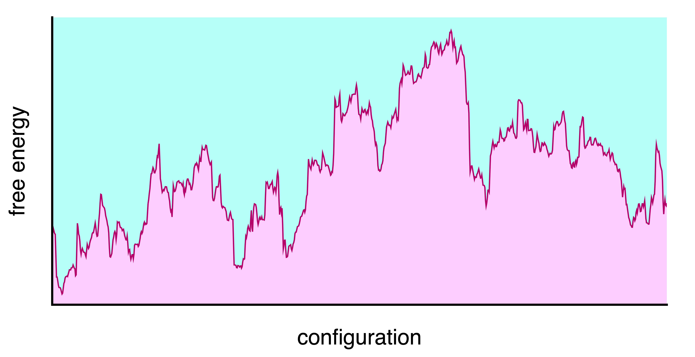

## Energy landscapes

- Different minima correspond to different conformations or **states** of the system. (e.g. liquid/gas, crystal/amorphous solid, folded/unfolded protein)
- They are separated by **energy barriers** $\Delta F$
- The time to transition is often modelled as Arrhenius $\tau \sim \exp\left(\dfrac{\Delta F}{k_{B} T}\right)$

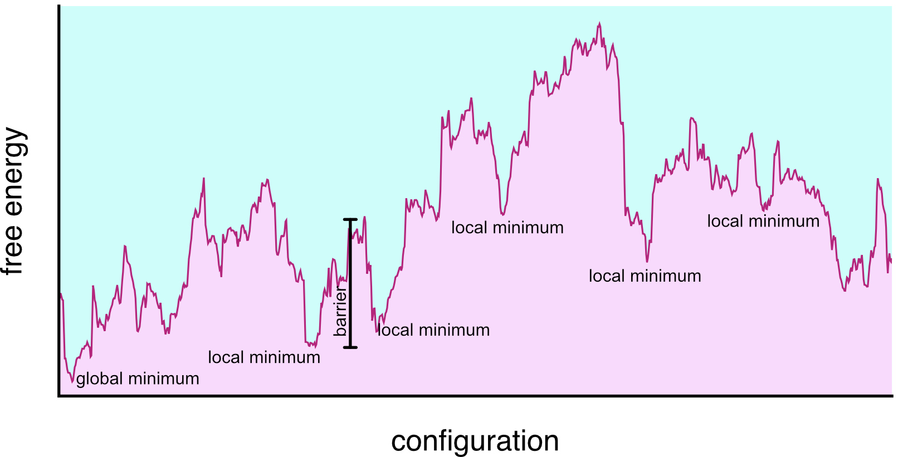

## Metabasins

When the temperature allows it, connected minima can be grouped into single **basins** called **metabasins**.

- they are not just energy minima, they include entropy
- they can behave as bone-fide local **equilibria**
- These are akin to the **metastable states**.

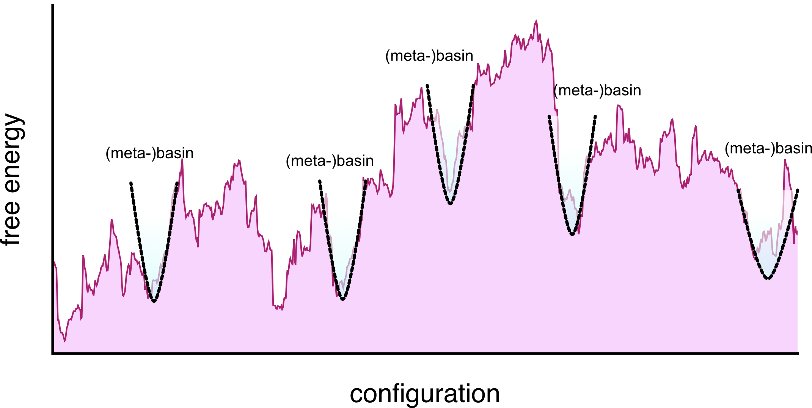

## Configurational entropy

- The number of distinct metabasins can be very large.
- We can define a **configurational entropy** $S_{conf}$ that counts the number of distinct states $\Omega$:
$$S_{conf} = k_{B} \ln N_{\mathrm minima}$$

**Different** from the total entropy $S$ 
$$
S(T) = S(T_0) + \int_{T_0}^{T} \frac{1}{T'} \left( \frac{\partial P}{\partial T'} \right)_V dV
$$

or (at constant volume)

$$
S(T) = S(T_0) + \int_{T_0}^{T} \frac{C_V(T')}{T'} dT'
$$
where $C_V$ is the heat capacity at constant volume and $T_0$ is a reference temperature.

For gas, fluids, and liquids at high T only the **total entropy** is well defined.

## Configurational entropy
:::{.columns}
::: {.column width="50%"}
As we take liquids to low temperatures, we can separate the total entropy into a vibrational and configurational part and define
$$ S_{conf}(T) = S(T) -S_{vib}(T)$$

For several fluids, this *decreases* with temperature in an intriguing way.

> […] Perhaps in some instances a thermodynamic **“freezing-in”** of degrees of freedom does take place as a desperate result of the liquid’s excessive generosity with its limited supply of entropy and energy as its temperature is lowered below the melting point. This would imply the existence of **some kind of state of high order** for the liquid at low temperature which **differs** from the normal crystalline state. A plausible structure for such a state seems, however, difficult to conceive, and we believe that the paradox is better resolved in another way […] (W. Kauzmann, Chem. Rev. 43, 219 (1948)).

:::
::: {.column width="50%"}

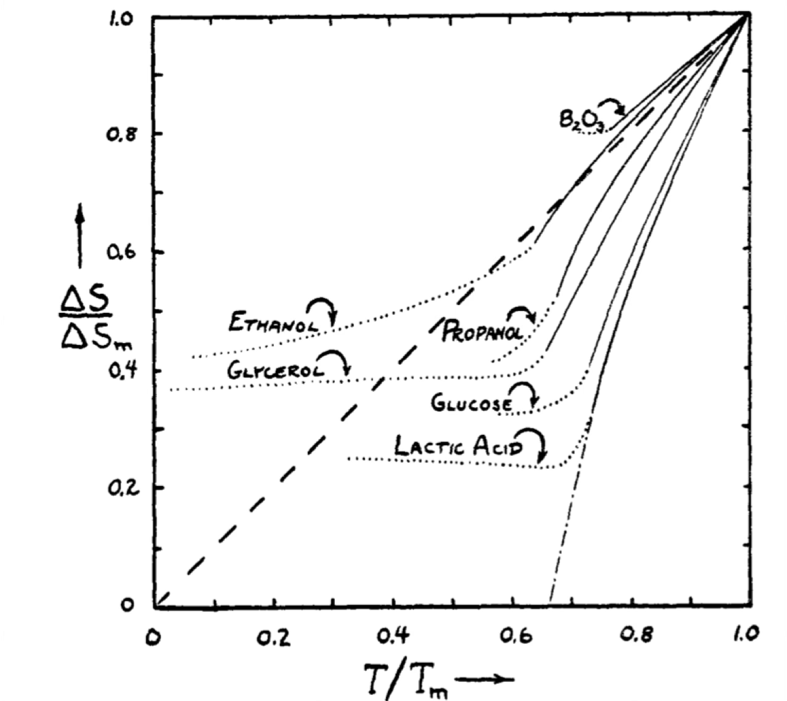
:::
:::

## Glasses

Glassy systems are a broad class of systems, not necessarily atomic or molecular, that exhibit **arrested dynamics**

- upon changing a thermodynamic parameter (e.g. temperature, density) the system's relaxation time $\tau$ increases dramatically
- the system falls out of equilibrium and becomes **non-ergodic**
- the system behaves as a solid, but lacks long-range order (it is **amorphous**)

| Glassformer         | Scale of Constituents      | Properties                                      |
|---------------------|---------------------------|-------------------------------------------------|
| Silicate glass      | Atomic (Si, O atoms)      | Strong, transparent, high melting point         |
| Metallic glass      | Atomic (metal atoms)      | High strength, corrosion resistant, ductile     |
| Polymer glass       | Macromolecular (polymers) | Flexible, low density, tunable glass transition |
| Colloidal glass     | Mesoscopic (colloids, ~nm–μm) | Opaque, tunable rheology, soft solid-like   |
| Molecular glass     | Molecular (organic molecules) | Low melting point, fragile, optical uses   |
| Sugar glass         | Molecular (sucrose, glucose)  | Brittle, water soluble, low thermal stability   |
| Chalcogenide glass  | Atomic (S, Se, Te atoms)  | Infrared transparency, phase-change memory      |

## Glassy systems

But glassy physics is broader than glassy materials: dense assemblies in general will display glassy dynamics.

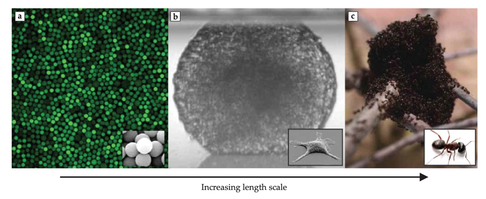 

## Glass formation

:::{.columns}
::: {.column width="30%"}
To form a glass we:

- start from the liquid at high temperature
- cool with a finite cooling rate fast enough to **avoid crystallisation**
- enter a local equilibrium state (the **supercooled liquid**)
- at some point the relaxation time $\tau$ becomes longer than the experimental time scale and the system **falls out of equilibrium** into a glassy state
- changing the cooling rate changes the glass transition temperature $T_g$ and the final glass properties
:::
::: {.column width="70%"}
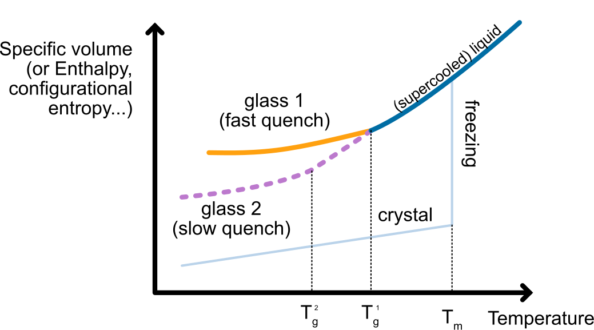
:::
:::

## Macroscopic Glass properties

- Glasses are **solids**: they have a finite shear modulus and yield stress
- Glasses are **amorphous**: they lack long-range order (no Bragg peaks in scattering experiments)
- Glasses are **history-dependent**: their properties depend on the cooling rate and thermal history
- Glasses exhibit **ageing**: their properties slowly evolve with time as they explore deeper minima in the energy landscape

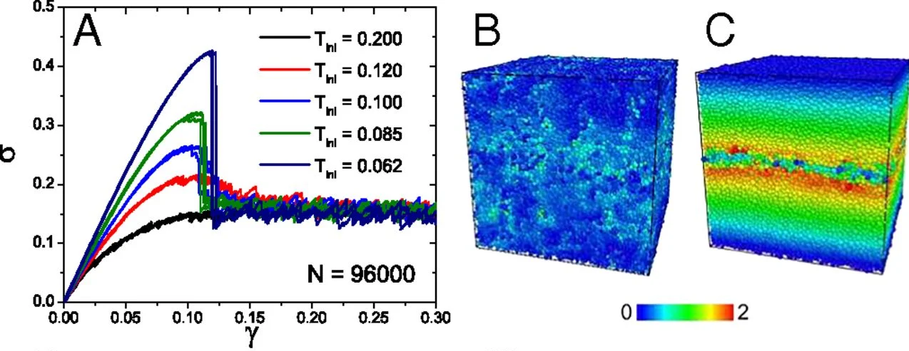

## Slowing down

:::{.columns}
::: {.column width="50%"}
Their solid-like behavior arises from the dramatic slowing down of their dynamics as they approach the glass transition.

We quantify this with density autocorrelation functions such as the intermediate scattering function:
$$F(k, t) = \frac{1}{N} \left\langle \sum_{j=1}^{N} e^{i \mathbf{k} \cdot [\mathbf{r}_j(t) - \mathbf{r}_j(0)]} \right\rangle$$

It decays in two steps:

- a fast decay corresponding to **vibrations** within the cage formed by neighbouring particles, occuring on a timescale called the **beta relaxation time** $\tau_{\beta}$
- a slow decay corresponding to **structural relaxation** as particles escape their cages, taking place on the much longer **alpha relaxation time** $\tau_{\alpha}$
:::
::: {.column width="50%"}
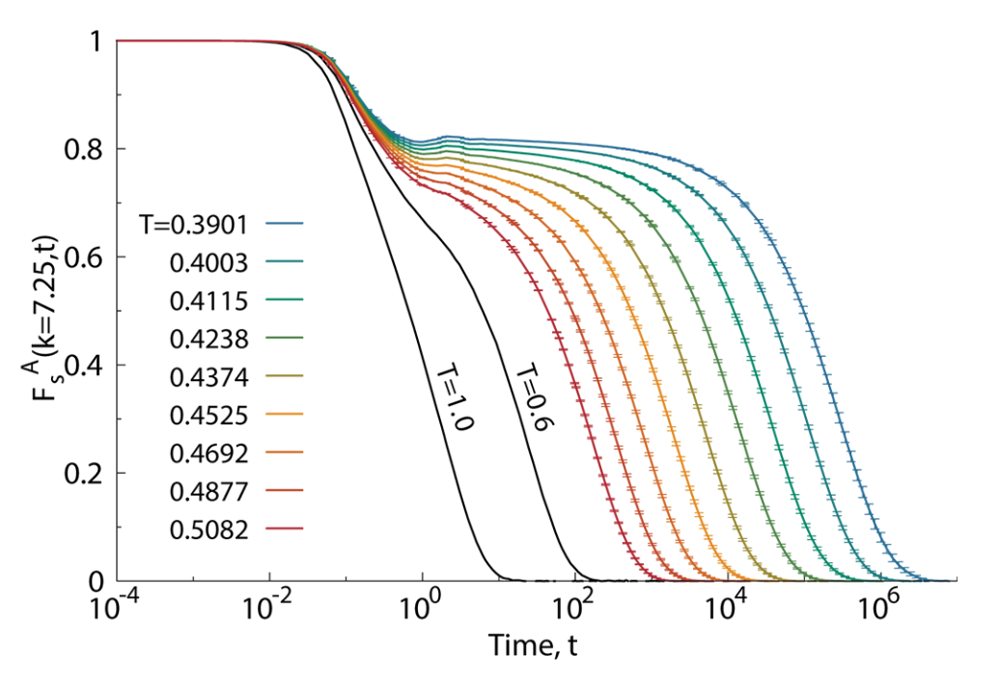
:::
:::

## Divergence of relaxation time and viscosity

:::{.columns}
::: {.column width="50%"}
The alpha relaxation time $\tau_{\alpha}$ is proportional to the viscosity $\eta$ and both increase dramatically as the temperature approaches the glass transition temperature $T_g$.

Phenomenologically one distinguishes between:

- **Strong glassformers**: Arrhenius behaviour of $\tau_{\alpha}$ and $\eta$ $\sim \exp\left(\dfrac{E_a}{k_{B} T}\right)$
- **Fragile glassformers**: super-Arrhenius behaviour $\tau_{\alpha}$ and $\eta$. Often modelled with the **Vogel-Fulcher-Tammann** (VFT) equation $\tau \sim \exp\left(\dfrac{A}{T - T_0}\right)$ where $T_0$ corrsponds to a **divergence** at **finite** temperature $\to$ **phase transition?**
:::
::: {.column width="50%"}
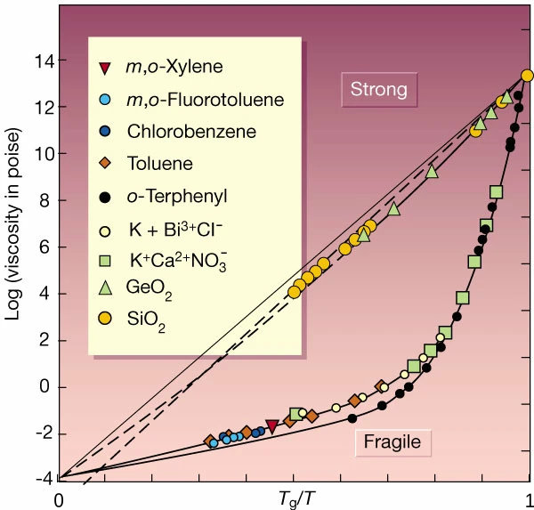
:::
:::

## Explaining the glass transition

- The glass transition is still not fully understood. 
- It is one of the major open problems in condensed matter physics.

We have however various theories, mainly in two broad classes:

- **Thermodynamic theories**: posit an underlying phase transition at a temperature $T_K$ (Kauzmann temperature) where the configurational entropy vanishes.
- **Dynamic theories**: attribute the slowing down to kinetic effects without invoking an underlying thermodynamic transition. 

## A thermodynamic theory: the Adam-Gibbs scenario

:::{.columns}
::: {.column width="50%"}
The **Adam-Gibbs model** links the dramatic slowdown of dynamics to the underlying thermodynamics through **configurational entropy** $S_{\rm conf}$.

- The key idea is the existense of **cooperatively rearranging regions** (CRRs): to relax, particles need to move together and explore a new metabasin in the energy landscape.

*Mosaic* of $M_{CRR}$ independent cooperatively rearranging regions of size $n_{CRR}$ particles each. The total number of particles is $N = M_{CRR} n_{CRR}$.

We **assume** that the total configurational entropy is additive and that each CRR contributes a constant amount $s_{conf}$, irrespective of its size

$S_{conf} = M_{CRR} s^* = \dfrac{N}{n_{CRR}} s^*$

Rearranging gives the size of a CRR as a function of the configurational entropy per particle $S_{conf}/N$:
$$n_{CRR}(T) \propto \dfrac{1}{S_{conf}(T)/N}$$
:::
::: {.column width="50%"}
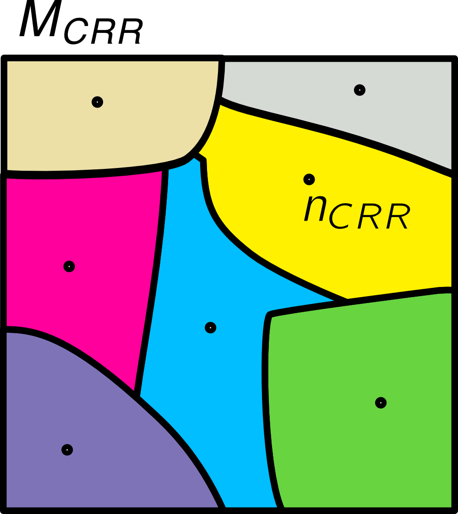
:::
:::

## A thermodynamic theory: the Adam-Gibbs scenario

We can then assume that the dynamics is activated with an energy barrier proportional to the size of a CRR:

$$\Delta E(T) \propto n_{CRR}(T)
$$

From Arrhenius activation, the relaxation time is then

$$
\tau_\alpha(T) = \tau_0 \exp\left(\frac{A}{T S_{\rm conf}(T)}\right)
$$

As temperature decreases, $S_{\rm conf}$ drops, causing $\tau_\alpha$ to increase rapidly. If $S_{\rm conf}$ vanishes at the Kauzmann temperature $T_K$, relaxation time diverges, reproducing the VFT form:
$$
\tau_\alpha(T) \sim \exp\left(\frac{B}{T - T_0}\right)
$$
with $T_0 \approx T_K$. This connects the kinetic slowdown to loss of configurational entropy making the theory thermodynamic.

It also points to a **critical divergence**: the size of the CRR needs to diverge as we approach $T_K$ to have $S_{conf} \to 0$.

- Evidence for decreasing configurational entropy and growing relaxation times exists, but the existence of a true thermodynamic transition at $T_K$ remains debated.

## A dynamic theory: dynamical facilitation

:::{.columns}
::: {.column width="70%"}
**Dynamical facilitation theory** provides an alternative to thermodynamic model. It stems from the observations that glassy systems are universally heterogenous in space and time: their mobility is very broadly distributed, with regions of high mobility **coexisting** with regions of low mobility. 

This **dynamical coexistence** is called **dynamical heterogeneity** and can be formalised as a dynamical phase transition.

**Key idea**: Mobility facilitates more mobility

- Relaxation occurs only near already-mobile regions
- No underlying thermodynamic transition required

**Temperature dependence**:

- **High T**: Many mobile regions → fast relaxation
- **Low T**: Few mobile regions → cooperative motion required → slow relaxation

The relaxation time follows a parabolic law
$$\log \tau_\alpha(T) \sim J^2 \left( \frac{1}{T} - \frac{1}{T_0} \right)^2$$

Unlike VFT, no finite-temperature divergence, no criticality, but still captures super-Arrhenius behavior.
:::
::: {.column width="30%"}
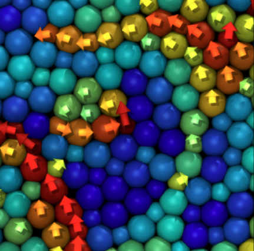

:::
:::
- Recent evidence suggests facilitation as a dominating mechanism for relaxation at low temperatures.

## Demonstration of facilitated dynamics and dynamical heterogeneities

Time evolution of the magnitude of the displacement field in a model of glass governed by dynamical facilitation from Hasym and Mandadapu PNAS (2024):

:::{.columns}
::: {.column width="25%"}
:::
:::{.column width="60%"}

:::
:::{.column width="15%"}

:::
:::
Excitations emerge and trigger further mobility in their vicinity, leading to a cascade of relaxation events.

## Unification

:::{.columns}
::: {.column width="50%"}
- Much more to glassy dynamics: 
    - geometrical frustration
    - local structures
    - growth of lengthscales
    - jamming
    - mean field solutions (see Nobel Prize Giorgio Parisi)

Ongoing work to unify the various scenarios.

- Example: Turci et al PRX (2017): a numerical demonstration that an extension dynamical facilitation is compatible with decreasing entropies, emergence of local structures and criticality.
:::
::: {.column width="50%"}
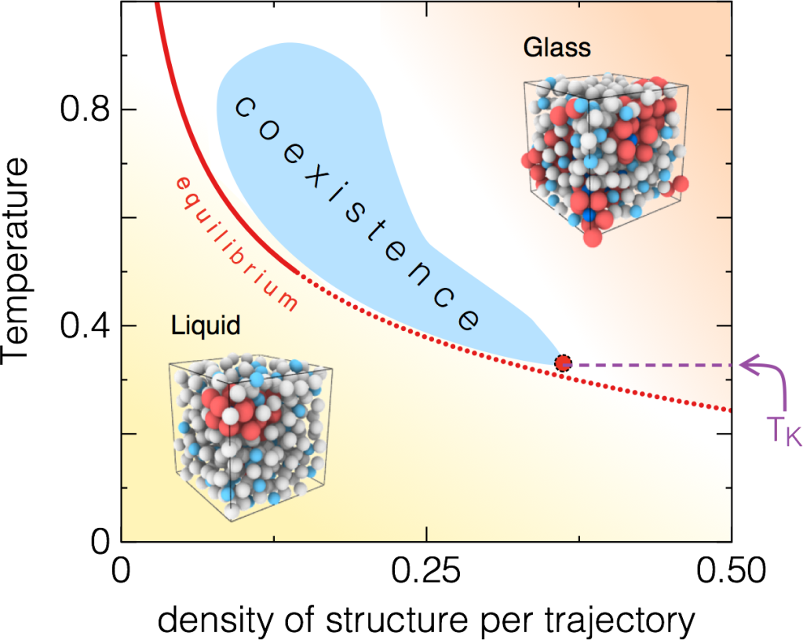
:::
:::

<!-- 
- the phase space is difficult to explore and so the system is **stuck**
- the system is just very slow and keeps on changing as we observe it (**ageing**)
- the system is driven by **external/internal** forces and so it never reaches equilibrium
- the system may have constraints on its dynamics that stop it from exploring all configurations (non-ergodic) -->
