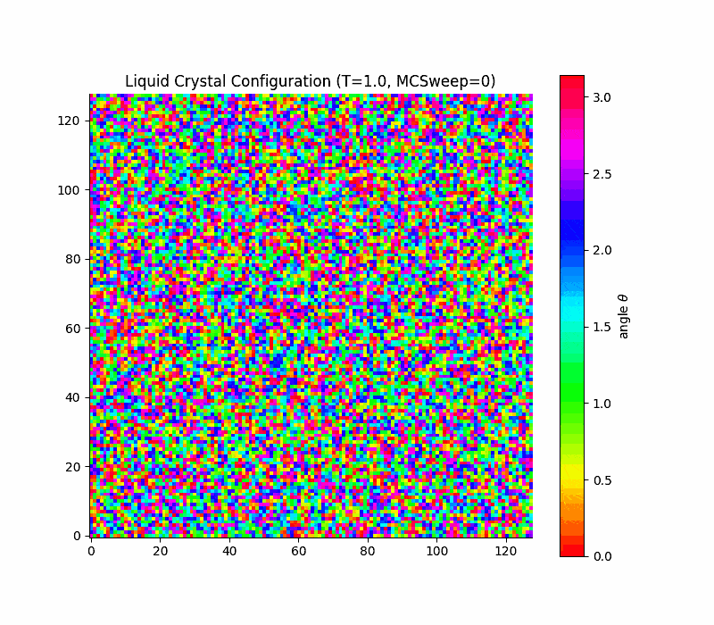
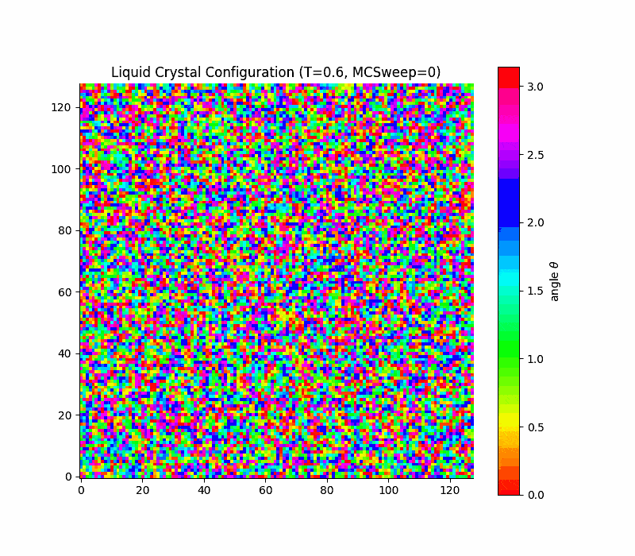
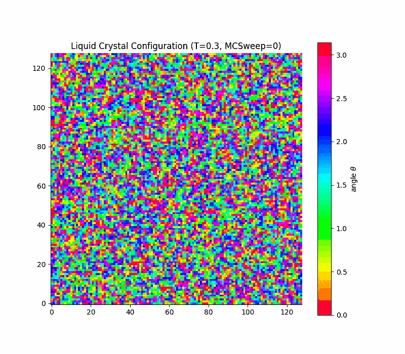
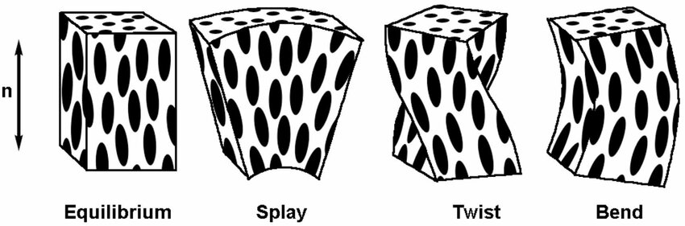
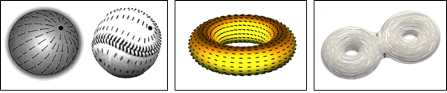
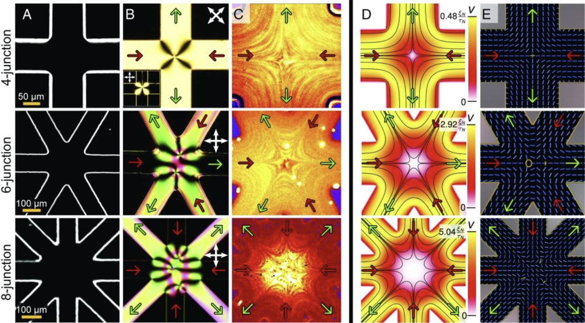
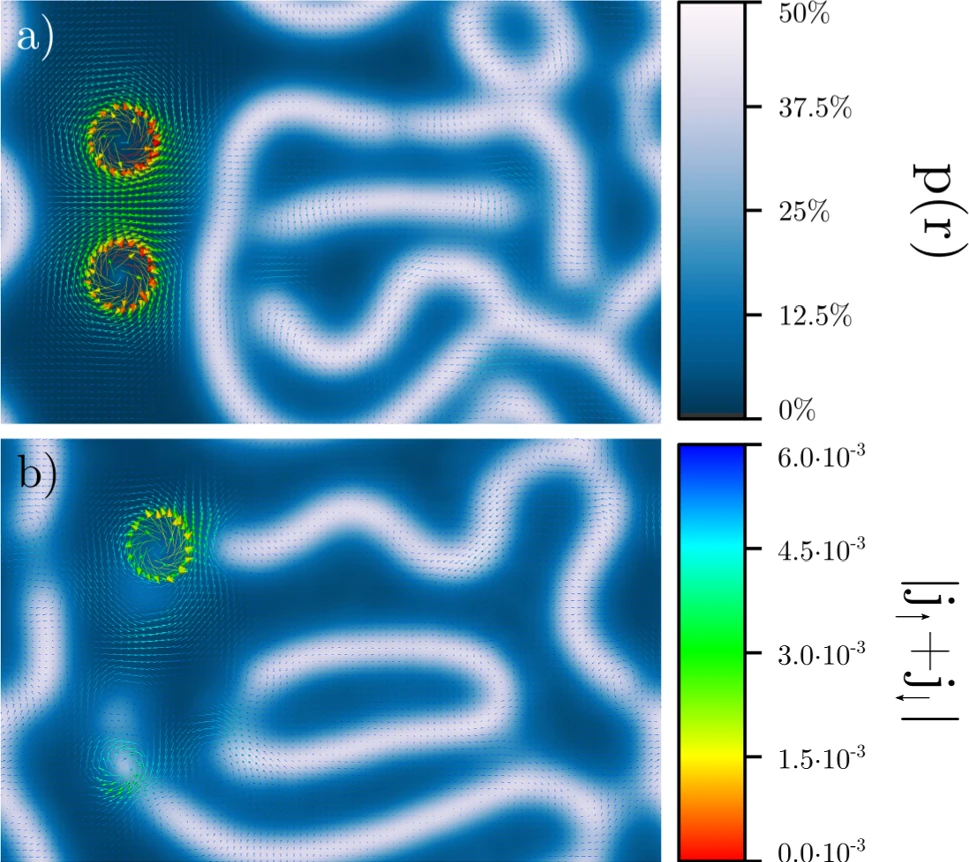
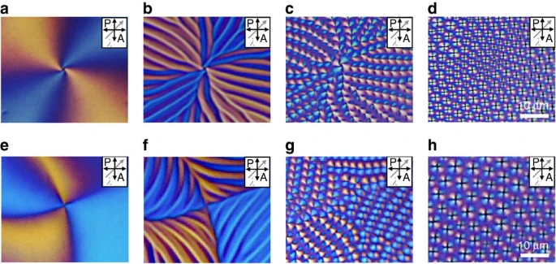
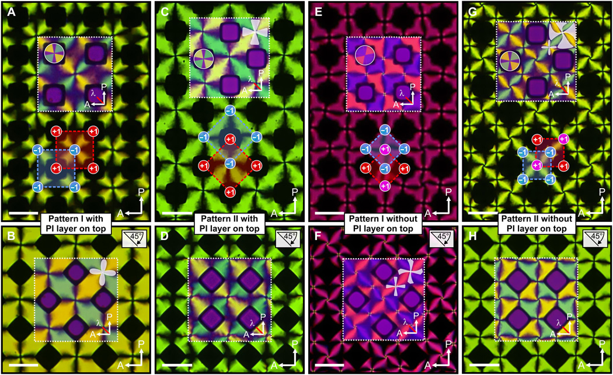

## Aside: Functional Derivatives

- Functional derivative is the extension of ordinary derivative to functionals (functions of functions)

- A general formulation (that you may have already seen) starts from an **action functional** $S[\phi]$:

$$S[\phi] = \int \mathcal{L}(\phi(x), \phi'(x), x) dx$$

$\mathcal{L}$ is the **Lagrangian function**: e.g.  $x$ is space,  $\phi(x)$ a field defined over space (e.g. density)

- Perturb $S[\phi]$ by an amount $\epsilon$ with an arbitrary function $\eta(x)$ vanishing at the boundaries

-  Integrate by part the second term to cast it all as an expression proportional to the test function $\eta(x)$:

$$
\delta S=\int\left[\frac{\partial \mathcal{L}}{\partial \phi}-\frac{d}{d x}\left(\frac{\partial \mathcal{L}}{\partial \phi^{\prime}}\right)\right] \eta(x) d x
$$

If we want $S[\phi]$ to be stationary with respect to arbitrary perturbations $\eta(x)$, then $\delta S=0$  for all $\eta(x)$. 

## Aside: Functional Derivatives

This leads to the **Euler-Lagrange equation**:

$$\frac{\partial \mathcal{L}}{\partial \phi}-\frac{d}{d x}\left(\frac{\partial \mathcal{L}}{\partial \phi^{\prime}}\right)=0$$

which defines the functional derivative as 
$$\frac{\delta S}{\delta \phi(x)}=\frac{\partial \mathcal{L}}{\partial \phi}-\frac{d}{d x}\left(\frac{\partial \mathcal{L}}{\partial \phi^{\prime}}\right)$$

## Maier-Saupe Theory of Nematic Liquid Crystals

- We saw the Landau-de Gennes free energy for nematic liquid crystals.$$
f-f_0=\frac{a}{3}\left(T-T^{\ast}\right) S^2-\frac{2 b}{27} S^3+\frac{c}{9} S^4 .
$$


    - phenomenological (the coefficients are results of a perturbation)
    - based on symmetries only (rotational invariance, head-tail symmetry)
    - no molecular basis

- The **Maier-Saupe theory** is a simple alternative **microscopic** mean-field theory that gives us a more physical insight.

- The idea is to construct the free energy as we have done in various prior cases by identifying:

    - an entropic contribution
    - an energetic contribution

As for the Landau-de Gennes theory, we will focus on :

- angular deviations $\theta$ from the director and their probability distribution $p(\theta)$
- a scalar orientational order parameter $\mathcal{S}$ 

## Maier-Saupe Theory of Nematic Liquid Crystals

### Energetic Contribution

- We assume molecules interact with an angular potential that depends on their orientations

$$
V\left(\Omega_i, \Omega_j\right)=-U_0 P_2\left(\mathbf{u}_i \cdot \mathbf{u}_j\right)
$$


We can average over all possible orientations of molecule $j$ to get the mean-field potential felt by molecule $i$:
$$
U_i^{\mathrm{mf}}(\Omega)=\rho \int V\left(\Omega, \Omega^{\prime}\right) p\left(\Omega^{\prime}\right) d \Omega^{\prime}=-u S P_2(\mathbf{u}_i \cdot \mathbf{n})
$$

where we have defined the scalar order parameter
$$
S=\int P_2\left(\mathbf{u} \cdot \mathbf{n}\right) p(\Omega) d \Omega
$$ and identified the director $\mathbf{n}$ and the energetic **coupling** $u$. 

So we can average the mean-field potential over all orientations of molecule $i$ to get the average interaction energy per molecule (and divide by 2 to avoid double counting):

$$U^{mf} =  -\dfrac{u}{2} S^2$$

In essence, we get a potential that aligns molecules with the director, and that is quadratic to reflect head-tail symmetry.


## Maier-Saupe Theory of Nematic Liquid Crystals

### Entropic contribution

The second conrirbution is **entropic** in nature.

Use orientational distribution function $p(\Omega)$ and (as in Landau-de Gennes) and assume uniaxial symmetry around the director $\mathbf{n}$, i.e.  $p(\Omega)\sim p(\theta)$.

The usual Gibbs (or Shannon) entropy functional $-k_B \int p(\Omega)\ln p(\Omega) d\Omega$ contributes to the free energy as

$$
f_{\rm entropy }=k_B T \int_0^\pi p(\theta) \ln (4 \pi p(\theta)) \sin \theta d \theta
$$

where $4\pi$ and $\sin \theta d \theta$ come from normalization over solid angle. [^1]


[^1]: Check that for the isotropic distribution $p(\theta)=1/4\pi$ the entropy is zero.

## Maier-Saupe Theory of Nematic Liquid Crystals

Together we, have the Maier-Saupe free energy functional per molecule

$$
f=f_0-u \frac{S^2}{2}+k_B T \int_0^\pi p(\theta) \ln (4 \pi p(\theta)) \sin \theta d \theta
$$

The only constraint is normalization of $p(\theta)$:
$$\int_0^\pi p(\theta) \sin \theta d \theta=1$$ where the $\sin \theta$ comes from the solid angle element.

Introduce the Lagrange multiplier $\lambda$ to enforce the constraint and minimize the functional and set the variation to zero:
$$
\delta\left[f+\lambda\left(\int_0^\pi p(\theta) \sin \theta d \theta-1\right)\right]=0
$$
The functional derivative yields (check!):

$$
\frac{\delta f}{\delta p(\theta)}+\lambda \sin \theta=0
$$

## Maier-Saupe Theory of Nematic Liquid Crystals

Remember that - by **definition** - 

$$S=\left\langle P_2(\cos \theta)\right\rangle=\int_0^\pi P_2(\cos \theta) p(\theta) \sin \theta d \theta$$

So 
$$\dfrac{\delta S^2}{\delta p} =2 S P_2(\cos\theta)\sin\theta $$ 

So when calculating the partial derivative we have

$$\dfrac{\delta f}{\delta p} =-uS P_2(\cos\theta)\sin\theta +k_BT\left(\ln(4 \pi p(\theta)) + 1\right) \sin \theta $$

and hence, after simplifying $\sin \theta$, our Lagrange equation reads

$$-u S P_2(\cos \theta)+k_B T(\ln (4 \pi p(\theta))+1)+\lambda=0$$

Its solution yields 

$$p(\theta)=\frac{1}{Z} \exp \left(\lambda P_2(\cos \theta)\right)=\frac{1}{Z} \exp \left(\frac{u S}{k_B T} P_2(\cos \theta)\right)
$$

where the partition function $Z$ ensures normalization.


## Self-consistency in the Maier-Saupe Result

The solution is said to be **self-consistent** because $p(\theta)$ depends on $S$, which in turn depends on $p(\theta)$.

The self-consistency condition is

$$
S = \int_0^\pi P_2(\cos \theta) p(\theta) \sin \theta d\theta
$$

where $p(\theta)$ itself depends on $S$:

$$
p(\theta) = \frac{1}{Z} \exp\left(\frac{u S}{k_B T} P_2(\cos \theta)\right)
$$

This equation must be solved for $S$ at each temperature $T$. 

In general, this requires a **numerical** solution (see problem classes for a special case where we can make progress analytically).

<br></br>

##  Maier-Saupe: Numerical Solution

```{python}
#| echo: false

import numpy as np
import matplotlib.pyplot as plt

thetas = np.linspace(0, np.pi, 200)
P2 = 0.5*(3*np.cos(thetas)**2 - 1)
plt.rcParams['font.size'] = 20
plt.figure(figsize=(15,8))

for u in np.linspace(1, 10, 10):
    λ_vals = np.linspace(0.01, 20, 500)
    S_list = []
    F_list = []
    for l in λ_vals:
        p_theta = np.exp(l * P2)
        p_theta /= np.trapz(p_theta * np.sin(thetas), thetas)
        S_l = np.trapz(p_theta * P2 * np.sin(thetas), thetas)
        f = -0.5*u*S_l**2 + np.trapz(p_theta * np.log(4*np.pi*p_theta) * np.sin(thetas), thetas)
        S_list.append(S_l)
        F_list.append(f)
    S_array = np.array(S_list)
    F_array = np.array(F_list)
    plt.plot(S_array, F_array - F_array[0], label=f"u={u:.1f}")

plt.xlabel("Order parameter S")
plt.ylabel("Free energy density / k_BT")
plt.legend(frameon=False, title="u", ncol=2)
plt.show()

```

[🪁 Play with the numerical solution](https://fturci.github.io/course-disordered-matter/soft-matter/soft-matter_liquidcrystals.html#maier-saupe-theory)


##  Maier-Saupe: Numerical Solution

```{python}
#| echo: false

import numpy as np
import matplotlib.pyplot as plt

import numpy as np
import matplotlib.pyplot as plt

plt.rcParams['font.size'] = 20
plt.figure(figsize=(15,8))
thetas = np.linspace(0, np.pi, 200)
P2 = 0.5*(3*np.cos(thetas)**2 - 1)
u_values = np.linspace(0, 10, 100)
T = 1.0
S_vs_u = []

for u in u_values:
    S_min_f = None
    λ_vals = np.linspace(0.01, 20, 500)
    for l in λ_vals:
        p_theta = np.exp(l * P2)
        p_theta /= np.trapz(p_theta * np.sin(thetas), thetas)  # normalization
        S_l = np.trapz(p_theta * P2 * np.sin(thetas), thetas)
        f = -0.5 * u * S_l**2 + T * np.trapz(p_theta * np.log(4*np.pi*p_theta) * np.sin(thetas), thetas)
        if S_min_f is None or f < S_min_f[1]:
            S_min_f = (S_l, f)
    S_vs_u.append(S_min_f[0])

plt.plot(u_values, S_vs_u, 'o-')
plt.xlabel(r"$u / k_B T$")
plt.ylabel("Order parameter S")
plt.show()

```
The resulting phase transition is weakly first order with a discontinuous jump in $S$ at the transition temperature. $u/k_BT \approx 4.55$.


## Quick comparison Maier-Saupe vs Landau-de Gennes

- Both theories predict a first-order isotropic-nematic phase transition with a discontinuous jump in the order parameter $S$.
- Landau-de Gennes is phenomenological, Maier-Saupe is microscopic.
- Maier-Saupe provides a molecular basis for the coefficients in Landau-de Gennes
- Both theories can be extended to include spatial variations in the order parameter and director field, leading to descriptions of defects and elasticity in nematic liquid crystals.
- Maier-Saupe requires self-consistency requirement, while Landau-de Gennes is often simpler to analyze analytically: (slightly) harder numerics.
- Easier to cast Maier Saupe onto a lattice model (Lebwohl-Lasher).


<details>
<summary>What about <b> hard rods </b>? Can we get nematic order from purely entropic effects?</summary>
The answer may look puzzling: if we take the Maier-Saupe model literally, $u$ must be nonzero for the transition to occur.

However, we can think of the rod-rod interaction not as a true energetic one, but also representing effective interactions, such as depletion.

Then the answer is **yes**, and hard-rods undergo an isotropic-nematic transition driven purely by entropy (Onsager theory, beyond this course).
</details>


## Simple lattice model: Lebwohl-Lasher

- A way to construct a Maier-Saupe-like model on lattice.
- Vectors on a lattice represent the orientations of molecules.
- Nearest-neighbor interactions favor alignment of neighboring vectors.


In 2D

$$
H=-\epsilon \sum_{\langle i, j\rangle}\left[\frac{3}{2} \cos ^2\left(\theta_i-\theta_j\right)-\frac{1}{2}\right]$$


🪁 Demonstration in class

## Simple lattice model: Lebwohl-Lasher

::: {.columns}

::: {.column width="33%"}

:::

::: {.column width="33%"}

:::

::: {.column width="33%"}

:::

:::

in 2d the transition is **rounded**, not true first order  (Kosterlitz-Thouless only quasi long range order) due to a key theorem due to **Mermin and Wagner ** which states that 

> **(Mermin-Wagner theorem)** Continuous symmetries **cannot be spontaneously broken** at finite temperature in systems with sufficiently short-range interactions in dimensions $d \leq 2$.

Long-range fluctuations are favoured in $d \leq 2$.

Here the continuous symmetry is the rotational invariance of the director field in the plane.

## Continuum limit and Frank elasticity

Charles Frank (1958, of our Frank lecture theatre) developed a continuum theory to describe the elastic properties of nematic liquid crystals.

The Frank free energy density describes the cost of spatial variations in the director field $\mathbf{n}(\mathbf{r})$:

$$
f_{\text{Frank}} = \frac{1}{2} K_1 (\nabla \cdot \mathbf{n})^2 + \frac{1}{2} K_2 (\mathbf{n} \cdot \nabla \times \mathbf{n})^2 + \frac{1}{2} K_3 (\mathbf{n} \times \nabla \times \mathbf{n})^2
$$  

-  $K_1$: **splay** elastic constant
-  $K_2$: **twist** elastic constant
-  $K_3$: **bend** elastic constant



With this free energy, one can model large-scale deformations and **defects** in nematic liquid crystals.

## Topological Defects in Nematic Liquid Crystals

- We are working in the continuum with a director field $\mathbf{n}(\mathbf{r})$ that describes the local average orientation of molecules.
- In this framekwork, defects are **singularities** of the field, called **disclinations**

- Examples in 2D:
```{python}
#| echo: false

#| code-fold: true
import numpy as np
import matplotlib.pyplot as plt

def plot_half_defect(ax, charge, title):
    # Grid
    x = np.linspace(-1, 1, 21)
    y = np.linspace(-1, 1, 21)
    X, Y = np.meshgrid(x, y)

    # Polar coordinates
    theta = np.arctan2(Y, X)

    # Director angle for nematic disclination
    # Only ±1/2 defects
    phi = charge * theta  # charge = +0.5 or -0.5

    # Director vectors (head-tail symmetry)
    U = np.cos(phi)
    V = np.sin(phi)
    mask = U < 0
    U[mask] *= -1
    V[mask] *= -1

    # Plot director field as short lines
    ax.quiver(
        X, Y, U, V,
        pivot='middle', color='black',
        scale=18, headwidth=0, headlength=0, headaxislength=0
    )

    # Defect core
    ax.plot(0, 0, 'o', color='orange', markersize=12)

    ax.set_title(title, fontsize=12)
    ax.set_aspect('equal')
    ax.set_xlim(-1.1, 1.1)
    ax.set_ylim(-1.1, 1.1)
    ax.set_xticks([])
    ax.set_yticks([])
    ax.axis('off')

# Plotting
fig, axs = plt.subplots(1, 4, figsize=(15, 8))
charges = [0.5, -0.5, +1, -1]
titles = ["+1/2 defect", "-1/2$ defect", "+1 defect",  "-1 defect"]

for ax, charge, title in zip(axs, charges, titles):
    plot_half_defect(ax, charge, title)

plt.tight_layout()
plt.show()

```

- These singularities cannot be removed by any smooth deformation of the field: they are **topologically protected**.

- To make them vanish, one needs oppositely signed defects to bring together so that they **annihilate** each other.

- At finite temperature, defects are spontaneously created/annihilated. 

## Topological Charge of a Defect

- The topological charge (or winding number) $s$ of a defect quantifies how many times the director field rotates by $2\pi$ when encircling the defect once.

$$\Delta \theta=2 \pi s$$

For example, a charge of $s=1/2$ is a rotation by $\pi$ is performed when going around the defect once.

```{python}
#| echo: false
import numpy as np
import matplotlib.pyplot as plt

def plot_charge_steps(ax, charge, step_frac, title=None):
    # Grid
    x = np.linspace(-1, 1, 20)
    y = np.linspace(-1, 1, 20)
    X, Y = np.meshgrid(x, y)
    theta = np.arctan2(Y, X)
    phi = charge * theta / 2
    U = np.cos(phi)
    V = np.sin(phi)
    # Nematic symmetry
    U2 = np.where(U < 0, -U, U)
    V2 = np.where(U < 0, -V, V)
    ax.quiver(X, Y, U2, V2, pivot='middle', color='k', scale=30, headwidth=0, headlength=0, headaxislength=0, linewidth=0.7, linestyle='dashed')
    # Defect core
    ax.plot(0, 0, 'o', color='orange', markersize=10)
    # Draw circle and arc
    circle_r = 0.7
    t = np.linspace(0, 2*np.pi, 200)
    ax.plot(circle_r*np.cos(t), circle_r*np.sin(t), color='gray', lw=1, alpha=0.5)
    # Arc for winding
    arc_t = np.linspace(0, 2*np.pi*step_frac, 100)
    ax.plot(circle_r*np.cos(arc_t), circle_r*np.sin(arc_t), color='crimson', lw=5)
    # Arrowhead to show progress
    if step_frac > 0:
        arrow_theta = 2*np.pi*step_frac
        ax.arrow(circle_r*np.cos(arrow_theta), circle_r*np.sin(arrow_theta),
                 -0.08*np.sin(arrow_theta), 0.08*np.cos(arrow_theta),
                 head_width=0.06, head_length=0.12, fc='crimson', ec='crimson')
    # Director rotation calculation
    total_angle = charge * 2*np.pi * step_frac
    # Format for display
    angle_deg = np.rad2deg(total_angle)
    if title is None:
        title = f"Progress: $0 \\to {step_frac:.2f}\\times 2\\pi$\nDirector rotates: {total_angle:.2f} rad ({angle_deg:.1f}°)"
    else:
        title = f"{title}\nDirector rotates: {total_angle:.2f} rad ({angle_deg:.1f}°)"
    ax.set_title(title, fontsize=10)
    ax.set_aspect('equal')
    ax.set_xticks([])
    ax.set_yticks([])
    ax.set_xlim(-1.1, 1.1)
    ax.set_ylim(-1.1, 1.1)
    ax.axis('off')

fig, axs = plt.subplots(1, 3, figsize=(15, 7))
steps = [1/6, 0.5, 1.0]
titles = [
    "Start winding: $0 \\to \\pi/3$",
    "Halfway: $0 \\to \\pi$",
    "Full loop: $0 \\to 2\\pi$"
]
for ax, frac, title in zip(axs, steps, titles):
    plot_charge_steps(ax, 0.5, frac, title)
plt.tight_layout()
plt.show()
```

## Conservation of Topological Charge

- Topological charge is **conserved**: the total charge in a closed system remains constant over time.
- Defects can be created or annihilated only **in pairs** of opposite charge (e.g., +1/2 and -1/2).
- The **topology** of the space imposes such constraints of conservation via the *Poincaré-Hopf theorem*, which states

> The total topological charge of the defects in a field confined to a compact space is equal to the Euler characteristic of that space

In practice:

- On a plane (Euler characteristic = 1), the total topological charge must sum to 1.
- On a sphere (Euler characteristic = 2), the total topological charge must sum to 2.
- On a torus (Euler characteristic = 0), the total topological charge must sum to 0. $\to$ in periodic systmes the total charge must be zero.

- This imposes constraints on the dynamics and interactions of defects.




## Topological defects
:::{.columns}
:::{.column}
Analogies well-beyond liquid crystals:

- vortices in superfluids and superconductors
- dislocations in crystals
- electromagnetic field configurations
- flow fields microfluidic junctions


:::
:::{.column}

:::
:::
## Defects in 3 Dimensions

- In 3D the disclinations become **lines**
- The director field wraps around the line defect in a similar way as in 2D.
- The classification of disclination in 3D involves the rotation group SO(3) (that generalises the construction we have seen in two dimensions) and are more complex in general. They include 

    - lines
    - closed loops
    - point-like features (hedgehogs and monopoles)
    - complex textures.


```{python}
#| echo: false
import numpy as np
import plotly.graph_objects as go

# 3D grid
x = np.linspace(-1, 1, 10)
y = np.linspace(-1, 1, 10)
z = np.linspace(-1, 1, 10)
X, Y, Z = np.meshgrid(x, y, z, indexing='ij')

# Twist rate along z
k = 4 * np.pi  # 2 full twists from z=-1 to z=1

# Twisting director field
phi = np.arctan2(Y, X) + k * Z
U = np.cos(phi / 2)
V = np.sin(phi / 2)
W = np.zeros_like(U)  # Still planar vectors, but twisting

# Mask to avoid core
mask = np.sqrt(X**2 + Y**2) > 0.2
x0 = X[mask].flatten()
y0 = Y[mask].flatten()
z0 = Z[mask].flatten()
u = U[mask].flatten()
v = V[mask].flatten()
w = W[mask].flatten()

# Director line segment
L = 0.2
x1 = x0 - L * u / 2
x2 = x0 + L * u / 2
y1 = y0 - L * v / 2
y2 = y0 + L * v / 2
z1 = z0 - L * w / 2
z2 = z0 + L * w / 2

# Plot
fig = go.Figure()


# Add symmetric director lines
for i in range(len(x0)):
    fig.add_trace(go.Scatter3d(
        x=[x1[i], x2[i]], y=[y1[i], y2[i]], z=[z1[i], z2[i]],
        mode='lines',
        line=dict(color='green', width=4),
        showlegend=False
    ))

# Helical disclination core: x = r cos(kz), y = r sin(kz)
r_core = 0.05
z_core = np.linspace(z.min(), z.max(), 200)
x_core = r_core * np.cos(k * z_core)
y_core = r_core * np.sin(k * z_core)

fig.add_trace(go.Scatter3d(
    x=x_core, y=y_core, z=z_core,
    mode='lines',
    line=dict(color='orange', width=6),
    name='Helical Disclination Core'
))

# Layout
fig.update_layout(
    scene=dict(
        xaxis=dict(visible=False),
        yaxis=dict(visible=False),
        zaxis=dict(visible=False),
        aspectmode='cube'
    ),
    margin=dict(l=0, r=0, b=0, t=30),
    title="3D Twisting Nematic Disclination Line"
)

fig.show()
```

## Defects and Phase Transitions

Defects control the stability and dynamics of nematic liquid crystals and drive the phase transitions between phases.



## Complex Disclocation Patterns

Example from Kim et al Science Advances (2018)


