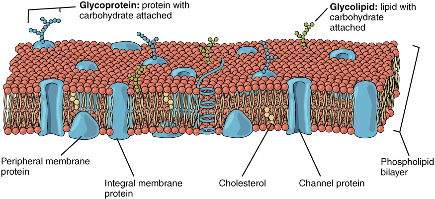
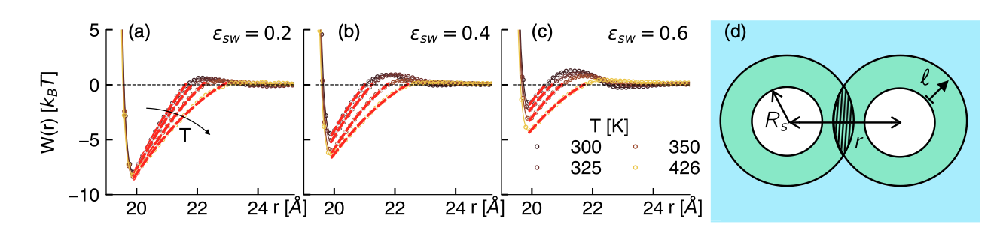
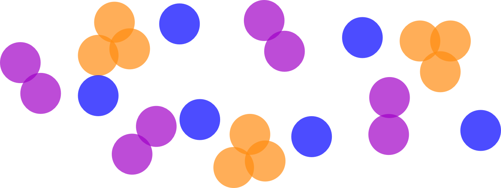
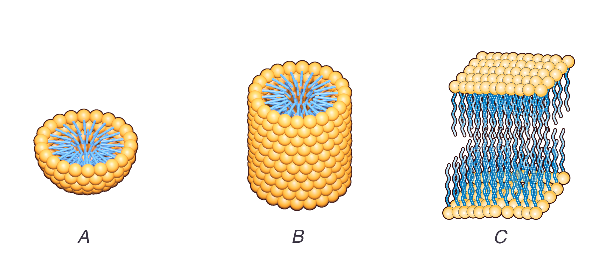
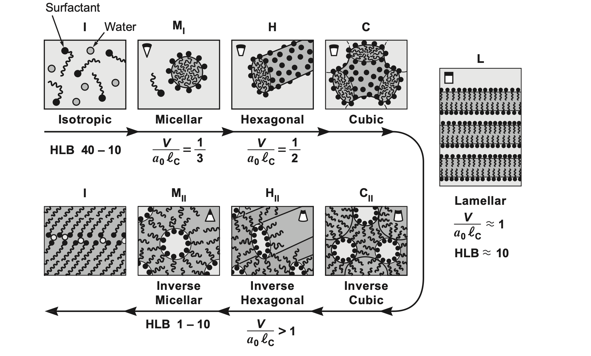

## Hydrophobicity and amhiphiles

Water is the standard solvent for a lot of chemistry and (almost all) biology.

Molecules in water can be classified by their **affinity** to water:

- **Hydrophilic** ("water-loving") molecules interact favorably with water (e.g., via hydrogen bonding or dipole interactions).
- **Hydrophobic** ("water-fearing") molecules do not interact favorably with water (e.g., non-polar molecules).


**Amphiphiles** are molecules that contain both hydrophilic and hydrophobic parts. They include:

- Surfactants (detergents, soaps, *SURFace ACTive AgeNT*)
- Lipids (cell membranes)
- Some proteins (with hydrophobic and hydrophilic amino acids)


## Hydrophobicity and amphiphiles



## Hydrophobicity in brief

The hydrophobic interactions is a topic of active research.

Various approaches

- (from to 1950s) structural approach: water forms cages around molecules. When the cage is disrupted, entropy increases. Solutes come together to minimise the disruption.
- (from 2000s) interfaces approach: water is a fluctuating medium. Large hydrophobic solutes create interfaces that suppress fluctuations. Solutes come together to minimise the interface area.
- (current research) avoided criticality: water is close to a liquid-vapour critical point. Local curvature and interactions promote large density fluctuations. Solutes interact on scales controlled by these fluctuations.



In all cases, the hydrophobic effect originates in **fluctuations of the solvent**, i.e. the way the solvent explores the available configuration.

## Self assembly of surfactants


```{ojs}
//| echo: false
viewof temperature = Inputs.range([0.01, 2], {step: 0.05, label: "Temperature (kT)", value: 0.5})
```
```{ojs}
//| echo: false
viewof numChains = Inputs.range([3, 300], {step: 10, label: "Number of Chains", value: 100})
```
```{ojs}
//| code-fold: true
// This is ObservableJS code  
// You can run at observableehq.com or convert it to an equivalent (and faster?) Python version if you like
viewof simulation = {
    // --- Parameters ---
    const width = 40, height = 40;
    const chainLength = 3;
    const chainsToCreate = numChains;
    const T = temperature;
    // const numChains = 10;
    const E_TS = 1.0;     // tail-solvent energy (solvophobic)
    const E_HS = -1.5;    // head-solvent energy (solvophilic)
    // const T = 0.1;        // temperature (kT units)

    // --- Initialize grid and chains ---
    let grid = Array.from({length: width}, () => Array(height).fill(null));
    let chains = [];

    // Periodic boundary helper
    function mod(n, m) { return ((n % m) + m) % m; }

    function getNeighbors(x, y) {
        return [
            {x: mod(x - 1, width), y: y},
            {x: mod(x + 1, width), y: y},
            {x: x, y: mod(y - 1, height)},
            {x: x, y: mod(y + 1, height)}
        ];
    }

    function placeChains() {
        for (let id = 0; id < numChains; id++) {
            for (let tries = 0; tries < 100; tries++) {
                let x = Math.floor(Math.random() * width);
                let y = Math.floor(Math.random() * height);
                if (grid[x][y]) continue;

                let chain = [{x, y, type: 'head'}];
                grid[x][y] = {id, type: 'head'};
                let ok = true;

                for (let i = 1; i < chainLength; i++) {
                    let last = chain[chain.length - 1];
                    let nbs = getNeighbors(last.x, last.y).filter(p => !grid[p.x][p.y]);
                    if (nbs.length === 0) { ok = false; break; }
                    let next = nbs[Math.floor(Math.random() * nbs.length)];
                    chain.push({...next, type: 'tail'});
                    grid[next.x][next.y] = {id, type: 'tail'};
                }

                if (ok) { chains.push({id, segments: chain}); break; }
                else { chain.forEach(p => grid[p.x][p.y] = null); }
            }
        }
    }

    function energy(seg) {
        let solventNbs = getNeighbors(seg.x, seg.y).filter(p => !grid[p.x][p.y]).length;
        return seg.type === 'head' ? solventNbs * E_HS : solventNbs * E_TS;
    }

    function attemptMove(chain) {
        const forward = Math.random() < 0.5;
        const tail = forward ? chain.segments[0] : chain.segments.at(-1);
        const head = forward ? chain.segments.at(-1) : chain.segments[0];
        const options = getNeighbors(head.x, head.y).filter(p => !grid[p.x][p.y]);

        if (options.length === 0) return;
        const next = options[Math.floor(Math.random() * options.length)];

        const dE_old = energy(tail);
        grid[tail.x][tail.y] = null;
        const dE_new = energy({...next, type: tail.type});
        grid[tail.x][tail.y] = {id: chain.id, type: tail.type};

        const deltaU = dE_new - dE_old;
        const accept = deltaU < 0 || Math.random() < Math.exp(-deltaU / T);

        if (accept) {
            grid[tail.x][tail.y] = null;
            grid[next.x][next.y] = {id: chain.id, type: tail.type};
            if (forward) {
                chain.segments.shift();
                chain.segments.push({...next, type: tail.type});
            } else {
                chain.segments.pop();
                chain.segments.unshift({...next, type: tail.type});
            }
        }
    }

    // --- Visualization ---
    const svg = d3.create("svg")
        .attr("viewBox", `0 0 ${width} ${height}`)
        .style("width", "400px")
        .style("height", "400px")
        .style("border", "1px solid #ccc");

    const g = svg.append("g");

    function draw() {
        const data = chains.flatMap(c => c.segments);
        g.selectAll("circle")
            .data(data, d => `${d.x}-${d.y}`)
            .join("circle")
            .attr("cx", d => d.x + 0.5)
            .attr("cy", d => d.y + 0.5)
            .attr("r", 0.45)
            .attr("fill", d => d.type === "head" ? "blue" : "red");
    }

    // --- Main Loop ---
    placeChains();
    draw();

    let running = true;
    const button = html`<button>⏸ Pause</button>`;
    button.onclick = () => {
        running = !running;
        button.textContent = running ? "⏸ Pause" : "▶ Resume";
    };

    (async () => {
        while (true) {
            if (running) {
                for (let i = 0; i < chains.length; i++) {
                    const c = chains[Math.floor(Math.random() * chains.length)];
                    attemptMove(c);
                }
                draw();
            }
            await new Promise(r => setTimeout(r, 50));
        }
    })();

    return html`<div>${button}<br>${svg.node()}</div>`;
}

```


## Self assembly of surfactants

- Surfactants are at the molecular scale so they are *nanometer* sized

    - Diffusion is **fast** (e.g. use $D=\frac{k_B T}{6 \pi \eta R}$ to compare a colloid to a surfactant molecule)
    - $\to$ quickly explore possible conformations and minimise free energy.

- The amphiphilic structure means that special orientations can be achieved to satisfy the energetic constraints.

- The molecules spontaneously form structures: this is called **self-assembly**.
- Underlying phase transitions typically **drive** the self-assembly.


## Aggregation: general case

- Consider a generic problem of aggregation of particles (generic)
- Simple model: we have cluster of size $N$ and a free energy cost $\epsilon_N$ pto add a particle to the cluster.
- Let $\mu_1$ and $\mu_N$ be the chemical potential of isolated particles and aggregates of size $N$ respectively. 

- In equilibrium, $\mu_1 = \mu_N := \mu$

 We can express $\mu$ in terms of 

- the interaction energy from being in the aggregate $\epsilon_N$
- the entropy of the aggregate as a whole $\propto {\text{ number of aggregates}}\times \ln {\text{ number of aggregates}}$


## Aggregation: general case
:::{.columns}
:::{.column}
- Let the overall **volume fraction** to be $\phi$
- Call $X_N$ the volume fraction in an aggregate of size $N$, so that $\sum_N X_N = \phi$.
-  The numbers of aggregates of size $N$ per unit volume is then simply $X_N/N$


:::

:::{.column}
:::{.callout-note}

# Example

* Suppose $\phi = 0.1$ (10% of the volume is particles).
* Let $X_3 = 0.06$, $X_2 = 0.04$ (so $\sum X_N = 0.06 + 0.04 = 0.1 = \phi$).
* Then the **number of trimers** is $0.06 / 3 = 0.02$ (fraction of solution volume in separate trimer aggregates).
* The **number of dimers** is $0.04 / 2 = 0.02$.

:::

:::
:::

{width=800}

The uniform chemical potential is then

$$\mu = \text{\{energy per particle in aggregate of size N\}} + \text{\{entropy of mixing  per particle in aggregate of size N\}}$$

or 
$$\mu = \epsilon_N + \dfrac{k_B T}{N}\ln{\dfrac{X_N}{N}}$$


## Aggregation: general case


From $$\mu = \epsilon_N + \dfrac{k_B T}{N}\ln{\dfrac{X_N}{N}}$$

we can rewrite this as 

$$X_N = N \exp{\left( \dfrac{N(\mu-\epsilon_N)}{k_BT}\right)}$$

and eliminate $\mu$ by evaluating the expression for for $N=1$ and plugging it back to get 

$$X_N = N X_1^N \exp{\left( \dfrac{N(\epsilon_1-\epsilon_N)}{k_BT}\right)}$$


The fraction of solutes in the aggregated state is large only if  $\epsilon_1>\epsilon_N$., i.e. there is an energetic advantage.


## Aggregation: general case


$$X_N = N X_1^N \exp{\left( \dfrac{N(\epsilon_1-\epsilon_N)}{k_BT}\right)}$$

means that knowing the form of $\epsilon_N$ is key to predicting aggregation behaviour.

- Consider an aggregate of $N$ particles of total radius $r\approx (Nv)^{1/3}$ where $v$ is the volume of a single particle.
- Then $\epsilon_N$ is the free energy per particle of the aggregate of size $N$, $$G_N/N=\dfrac{1}{N}(\text{ bulk free energy}+\text{surface free energy})$$
-  Assuming that there is a surface free energy cost (a surface tension) $\gamma$ we write

$$\epsilon_N = \dfrac{G_N}{N} = \epsilon_\infty  +\dfrac{1}{N}\gamma r^2 =\epsilon_\infty +\gamma\left(\dfrac{v^2}{N}\right)^{1/3}$$

which is a **monotonically decreasing** function of $N$. 

Define $\alpha k_B T = \gamma v^{2/3}$ and extract a relation between $X_N$ and $X_1$ parametrised solely by $\alpha$, i.e.

$$\text{number of aggregates of size N per unit volume} = \dfrac{X_N}{N}\sim (X_1 e^{\alpha})^N$$
 

## Aggregation: general case

$$\text{number of aggregates of size N per unit volume} = \dfrac{X_N}{N}\sim (X_1 e^{\alpha})^N$$
This presents us with a few cases depending on $\alpha= \gamma v^{2/3}/k_B T$


- **$X_1 e^{\alpha} < 1$**: Few isolated particles, and $(X_1 e^{\alpha})^N$ becomes vanishingly small for large $N$
- **$X_1 e^{\alpha} = 1$ (critical point)**: Aggregates of all sizes become equally probable. The system undergoes phase separation into a dilute phase of isolated monomers (with $X_1$ pinned at $e^{-\alpha}$) in coexistence with a dense phase of very large aggregates.
- **$X_1 e^{\alpha} > 1$**: Above the critical aggregation concentration, the system cannot remain homogeneous and phase separates. The volume fraction $\phi$ at which this occurs is called **critical aggregation concentration**, or CAC. 

$$\text{CAC} = X_1^* = e^{-\alpha} = \exp\left(-\frac{\gamma v^{2/3}}{k_B T}\right)$$

## Aggregation: general case


```{pyodide}
#| echo: false
import numpy as np
import matplotlib.pyplot as plt

def plot_aggregate_distribution(alpha, X1, N_max=50):
    """
    Plot the number of aggregates of size N per unit volume
    
    Parameters:
    alpha: dimensionless surface tension parameter (gamma * v^(2/3) / k_B T)
    X1: volume fraction of monomers
    N_max: maximum aggregate size to plot
    """
    N = np.arange(1, N_max + 1)
    
    # Number of aggregates of size N per unit volume: X_N/N ~ (X1 * exp(alpha))^N
    aggregate_density = (X1 * np.exp(alpha))**N
    
    plt.figure(figsize=(10, 4))
    plt.plot(N, aggregate_density, 'o-', linewidth=2, markersize=4)
    plt.xlabel('Aggregate size N')
    plt.ylabel('Number of aggregates per unit volume')
    plt.title(f'Aggregate size distribution\n(α = {alpha:.2f}, X₁ = {X1:.4f})')
    
    # Add vertical line at critical point
    critical_product = X1 * np.exp(alpha)
    if abs(critical_product - 1) < 0.1:
        plt.axhline(y=1, color='red', linestyle='--', alpha=0.7, 
                   label=f'Critical point (X₁e^α = {critical_product:.3f})')
        plt.legend()
    
    # Add text annotation about the regime
    if critical_product < 1:
        regime = f"Below CAC (X₁e^α = {critical_product:.3f} < 1)"
    elif critical_product > 1:
        regime = f"Above CAC (X₁e^α = {critical_product:.3f} > 1)"
    else:
        regime = f"At CAC (X₁e^α = {critical_product:.3f} = 1)"
    
    plt.text(0.02, 0.98, regime, transform=plt.gca().transAxes, 
             verticalalignment='top', bbox=dict(boxstyle='round', facecolor='wheat', alpha=0.8))
    
    plt.tight_layout()
    plt.show()
```

```{pyodide}
alpha = 2.0
CAC = np.exp(-alpha)
N1 = CAC *0.1
plot_aggregate_distribution(alpha, N1)

```

## Aggregation: surfactants case

Earlier we assumed that the free energy per particle was $$\epsilon_N = \epsilon_\infty +\gamma\left(\dfrac{v^2}{N}\right)^{1/3}$$
a monotonically decreasing function of $N$.

For surfactants, it is not necessarily the case.


- Typically $\epsilon_N$ has a minimum at some finite $N=N^*$ resulting from the fact that beyond a certain size, the aggregate becomes **unfavourable** (e.g., due to packing constraints, curvature energy, etc).
- Therefore the distribution of aggregates of size $N$ is **peaked** around $N^*$.
- This leads to the formation of **micelles**: aggregates of a characteristic size.

## Aggregation: surfactants case


## Critical micellar concentration (CMC)

The addition of surfactants to water initially reduces the water-air surface tension, but when the surface is saturated, further addition leads to crossing the a critical micellar concentration (CMC) and micelle formation.

- **Below** the CMC, almost all surfactant molecules are present as **monomers**
- **Above** the CMC, additional surfactant molecules predominantly form **micelles** of size $N^*$ while the monomer concentration remains nearly constant.

The aggregation in water follows specific patterns:

- hydrophobic tails cluster together to avoid water
- hydrophilic heads face the water

The structure on the micelle surface (formed by the heads) is disordered and fluid-like, similar to a 2D liquid.

).](./figs/Schematic-Micelle.svg)

## Critical micellar concentration (CMC)
](./figs/kruss-cmc.png)


## Shape of surfactant assemblies

- Geometric model of a surfactant molecule:

    - **optimal headgroup area $a_{0}$**: depends on chemical structure, pH and temeprature.
    - **volume $v$ of the hydrophobic part**: The hydrophobic part usually consists of hydrocarbon chains. Its volume $v\propto n$ the number of carbon atoms in the chain.
    - **critical chain length** $\boldsymbol{l}_{\boldsymbol{c}}$ : the effective length of the chain, taking into account chain flexibility, temperature, branching and chemical structure. It also scales like $l_c \propto n$.
    
A balance between energy and entropy leads to different self-assembled structures .



## Spherical micelle

For a spherical micelle of radius $R$ with aggregation number $N$ , the total volume and surface area are given by

$$
\begin{gathered}
N v=\frac{4 \pi}{3} R^{3} \\
N a_{0}=4 \pi R^{2}\end{gathered}$$

Therefore
$$\dfrac{v}{a_{0}}=\dfrac{R}{3}<\dfrac{l_{c}}{3}$$

where we used the fact that the radius $R$ cannot be larger than the critical chain length $\mathrm{l}_{\mathrm{c}}$. We thus obtain for the critical packing parameter $P$

$$
P=\frac{v}{a_{0} l_{c}}<\frac{1}{3}
$$

## Cylindrical micelles

For a cylindrical micelle of length $L$ the total volume and surface area are given by
$$N v=\pi R^{2} L$$

and

$$N a_{0}=2 \pi R L$$

Therefore $\dfrac{v}{a_{0}}=\dfrac{R}{2}<\dfrac{l_{c}}{2}$
again using $R<l_{C}$.

We thus obtain for the critical packing parameter $P=\dfrac{v}{a_{0} l_{c}}$
 that $$\dfrac{1}{3}<P<\dfrac{1}{2}$$

Below the lower limit spherical micelles are formed.

## Bilayers (lamellar)

For a bilayer (with separation $D$ between the layers and area $A$) the total volume and surface area are given by

$$
\begin{aligned}
& N v=A D \\
& N a_{0}=2 A \\
& \frac{v}{a_{0}}=\frac{D}{2}<l_{c} \quad\left(\text { using } D<2 l_{c}\right)
\end{aligned}
$$

We thus obtain for the critical packing parameter $P=\dfrac{v}{a_{0} l_{c}}$ that
$$\dfrac{1}{2}<P<1$$

Below the lower limit cylindrical micelles are formed.

## Packing parameter summary

